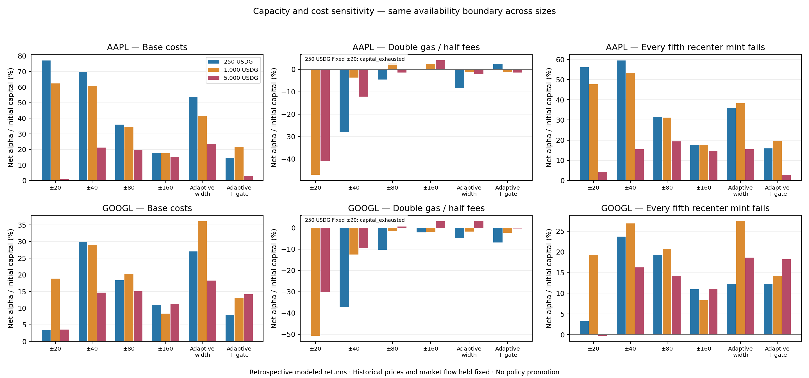
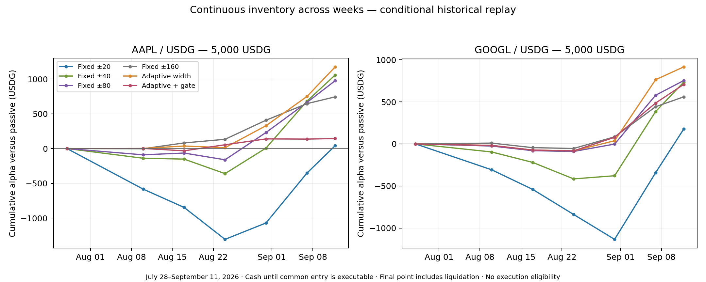

# Continuous adaptive LP comparison, July 28–September 11, 2026

The longer history materially changes the short-window result. At **5,000 USDG per asset**, adaptive width beats all four fixed widths at base costs on both AAPL and GOOGL, with lower modeled drawdown. However, the strongest rule changes with capital size and cost assumptions, and the historical liquidity assumptions remain material. This supports further adaptive research; it does not establish a production-ready strategy.

## Results

Net alpha below is USDG versus the same acquired-and-liquidated passive portfolio, after modeled costs. The stress column combines two separately funded 5,000-USDG portfolios. These are conditional simulated outcomes.

| Candidate | AAPL base alpha | GOOGL base alpha | Combined alpha, 2× gas / ½ fees |
| --- | ---: | ---: | ---: |
| Fixed ±20 | 41.32 | 178.05 | -3,557.91 |
| Fixed ±40 | 1,057.91 | 734.99 | -1,088.56 |
| Fixed ±80 | 975.86 | 753.73 | -37.50 |
| Fixed ±160 | 743.49 | 559.78 | 362.57 |
| Adaptive width | 1,174.69 | 916.06 | 61.49 |
| Adaptive + economic gate | 144.04 | 707.90 | -90.63 |

Adaptive width's base-case marked drawdown is **3.50% AAPL / 6.89% GOOGL**, versus **28.59% / 28.64%** for fixed ±20. Its absolute net P&L is +1,337.52 and +736.03 USDG respectively. The stress result separates relative performance from absolute profit: GOOGL adaptive width earns +161.60 alpha while its absolute P&L is -18.53. AAPL contributes -100.11 stressed alpha, leaving only +61.49 combined. Fixed ±160 performs better under that combined stress (+362.57).

At 1,000 USDG per asset, combined base alpha is +899.40 for ±40 versus +778.05 for adaptive width. At 250 per asset, it is +249.58 versus +202.14. At these smaller sizes AAPL favors fixed ±20 at base costs; GOOGL favors adaptive width at 1,000 and fixed ±40 at 250. Choosing whichever setting wins each cell now would be retrospective selection, not a frozen deployable rule.

Both 250-USDG fixed ±20 campaigns exhaust modeled capital in the double-gas/half-fee scenario. They are marked `capital_exhausted` and omitted from normal return rankings. Their later synthetic marked/terminal values remain in raw evidence for accounting diagnostics. After invalidation, the frozen policy stops decisions and fee accrual; its subsequent exposure/time summaries must not be treated as a valid managed campaign.



## What the additional weeks explain

The narrow baseline earns strongly in the late busy period but incurs substantial earlier losses. The following numbers attribute the same two continuous 5,000-USDG campaigns by UTC week; capital and passive holdings are never reset.

| Week starting | Combined ±20 alpha | Combined ±40 alpha | Combined adaptive-width alpha |
| --- | ---: | ---: | ---: |
| 2026-08-03 | -889.70 | -234.55 | -15.82 |
| 2026-08-10 | -496.44 | -136.54 | -20.43 |
| 2026-08-17 | -758.05 | -404.82 | -33.16 |
| 2026-08-24 | -59.90 | 404.87 | 436.15 |
| 2026-08-31 | 1,509.95 | 1,438.14 | 1,146.41 |
| 2026-09-07 | 913.49 | 725.79 | 577.59 |

The July 27 bucket contains only the initial cash wait and zero return. The last week is partial and includes terminal liquidation. Adaptive width beats ±20 in five of the six active weekly buckets on AAPL and four on GOOGL, but loses to ±20 in the busy August 31 week on both. Its benefit is partly avoiding earlier losses, not uniformly collecting more fees.



There is also a mechanism-identification limit. Adaptive width has additional forecast availability and feasibility requirements. At 5,000 USDG it records 1,156 `forecast_unavailable` decisions on AAPL and 5,944 on GOOGL, plus 6,811 and 2,748 `no_feasible_range` decisions. It spends 17.25% and 57.61% of invested time outside range. Fixed ±20 spends 3.20% and 19.07%. Consequently, this comparison does not isolate width forecasting from the effect of waiting when the forecast or proposed action is unavailable. A fixed-width control with matched forecast/feasibility availability is a necessary next diagnostic before assigning the gain to better width prediction.

The economic gate still fails to provide a consistent improvement over adaptive width. At 5,000 USDG it leaves AAPL outside range for 79.85% of invested time and GOOGL for 84.47%. It sharply reduces fees and action counts; fewer transactions alone are not evidence of better net outcomes.

The independent ten-minute fee probes show modest skill where occupancy matters: at ±20, mean absolute error improves by 9.83% on AAPL (2,351 probes) and 10.43% on GOOGL (1,619 probes) versus the trailing-always-active baseline. At ±40 the reductions are only 1.93% and 1.40%; wider probes show essentially no difference. Feasible probe counts differ by width, so these numbers compare each forecast with its own paired baseline, not the raw error level across widths. Probe endpoints retain the prior event-sampling convention and 90-second tolerance.

## Experiment definition

This extends the [short adaptive LP study](../adaptive-lp-study-2026-09-13/README.md) across the common AAPL/GOOGL history. Each portfolio is funded once and retains its actual inventory, fees, residual balances and gas liability across weeks. Weekly numbers attribute the same continuous campaign; they are not independently restarted backtests.

The six original candidates and all decision parameters remain frozen: fixed ±20/40/80/160 raw ticks, adaptive width, and adaptive width with the economic gate. The original validation-selected wider control remains ±40; no longer-window reselection is performed. Position sizes are 250, 1,000 and 5,000 USDG per asset. The three existing cost scenarios remain base costs, double gas with half fees, and failure after withdrawal/swap at every fifth executable recenter mint. This creates 108 continuous portfolios.

## Evidence boundaries

[plan.json](plan.json) fixes the requested July 28 00:00–September 11 19:30 UTC evaluation period, six-hour historical warmup, sizes and strategies. The reserved September 11 20:00 onward experiment is excluded. This is a retrospective extension, not a new untouched holdout. The rules were designed using September evidence before replaying these older dates. Causal trailing inputs do not make that backward evaluation a chronological out-of-sample test.

Archive reads found zero active liquidity and no initialized liquidity ticks for both pools at the warmup boundary, July 27 18:00 UTC. The first acquisition cannot be assumed executable simply because a pool had been initialized. The [availability amendment](availability-amendment.json), recorded before any strategy outcomes were computed, therefore keeps capital in cash until a common passive acquisition is executable. All sizes for an asset share the first event block where the largest size's half-stock acquisition fully fills within 50 bps and active liquidity is positive. Smaller portfolios deliberately wait for that same boundary, isolating size from entry timing. The common benchmark becomes executable on August 5 at 07:43:28 UTC for AAPL and August 4 at 11:24:26 UTC for GOOGL. Successful LP entries occur later under each candidate's delayed-fill rules. Earlier cash waiting time and zero-return weeks are disclosed; funds are never reset or replenished.

Canonical private-RPC logs include block timestamps and are matched exactly against database records: pool, block/hash, transaction/log order, transaction hash, raw data and topics. Every page pins an ending header; sampled log timestamps/hashes are checked against separately fetched headers. Reconstructed swaps and liquidity changes must reconcile with archive state at the final boundary, including price, tick, liquidity, fee-growth counters and protocol settings. Cursor disagreement is recorded as a reason to require direct reconciliation, not treated as evidence that a cursor alone proves completeness.

The verified capture contains 766,397 events across 396 pages: 309,698 AAPL events and 456,699 GOOGL events. Only 151,979 events precede September 1, so approximately 80.2% of the observations fall in September. Calendar duration and event count are different evidence dimensions.

The archived start is block 20,929,274; the end is block 60,504,934, immediately before September 11 19:30 UTC. The capture is read-only and resumable with per-page SHA-256 checks. Bulk RPC calls remain subject to the existing health gate. No production database, strategy, worker configuration or signer path is changed.

## How much the fee assumption matters

The frozen-action audit also classifies earned fee tokens by the ratio of our hypothetical position liquidity to existing canonical active liquidity in each fee-bearing segment. Fees are valued at the final source price, matching the replay's lifetime-fee metric. These are descriptive diagnostics, not new admission thresholds or bounds on economic error.

| Adaptive-width budget per asset | AAPL fees earned above 10% of existing liquidity | GOOGL fees earned above 10% | AAPL fees earned above 100% | GOOGL fees earned above 100% |
| --- | ---: | ---: | ---: | ---: |
| 5,000 USDG | 88.76% | 76.17% | 7.79% | 0.46% |
| 1,000 USDG | 58.00% | 29.23% | 0.18% | 0.27% |
| 250 USDG | 5.43% | 10.13% | 0.00% | 0.00% |

At 5,000 USDG, the modeled position reaches 5.92× existing active liquidity for adaptive AAPL and 9.56× for adaptive GOOGL. The fixed ±20 GOOGL maximum is much larger (3,250.86×); a peak alone can overstate the importance of a brief thin-liquidity episode, which is why the fee-weighted diagnostics are also provided. For fixed ±20 at 5,000 USDG, 36.56% of AAPL's fees and 19.79% of GOOGL's fees accrue while our liquidity exceeds the existing amount.

Smaller positions reduce this dependence substantially, but also change the ranking and increase gas relative to capital. The 5,000-USDG results cannot be presented as if we were a negligible participant. Holding historical prices and trading flow fixed under those additions remains an unverified economic assumption. [reconstruction.json](reconstruction.json) contains all 108 cases, including time above the two diagnostic ratios and invalidation timestamps. Capacity-time diagnostics for invalid campaigns explicitly include later hypothetical marks and are not valid policy rankings.

## Interpretation

Hypothetical fees retain the earlier rational input-distance allocation with liquidity dilution. The canonical market path remains fixed even though our capital could materially affect liquidity and trading. Exact token arithmetic and a tiny integer-apportionment gap do not establish counterfactual fee accuracy.

Costs retain the original September 13 asset-specific fork estimates and valuation. They are cost scenarios applied to earlier history, not historical receipts. The same bundle estimates are used across capital sizes; the smaller-size action paths have not received new size-specific fork estimates. Net swap fees and impact are already included in exact quoted token outputs. Gas is a separately funded native-token liability valued in USDG and deducted from NAV. Both strategy and passive receive terminal liquidation quotes against the same ending book.

The six-hour trailing forecast requires at least two hours and 60 observations, rejects gaps over 15 minutes and becomes stale after 90 seconds. Earlier sparse activity can therefore prevent adaptive entry or recentering. Missing inputs remain unavailable; they are not interpreted as zero volatility or zero cost. The canonical event capture is complete within its verified scope: a long event gap can represent genuine lack of pool activity rather than a missing event page. The frozen model nevertheless lacks a periodic wall-clock observation stream and applies its original sample-gap rejection. Its quote delays and forecast availability therefore test an event-driven model, not the production polling schedule. Reference, issuer and infrastructure eligibility are not reconstructed from historical swaps.

Weekly buckets use Monday-based UTC weeks. A price move across a weekly boundary belongs in full to the ending observation's week. Session attribution uses the existing New York market calendar, with cross-session moves in `mixed_boundary`. No move is prorated across an unobserved boundary. The final week includes terminal liquidation, which has its own session-attribution bucket. First and last weeks are partial; adjacent weeks share inventory and market conditions and are not independent statistical samples.

## Reproduction

The capture requires the existing operator configuration with database access, the canonical RPC and the archive RPC. No credential values are saved in review artifacts. Subsequent commands are offline and refuse to overwrite completed run evidence.

```sh
export PATH=/root/conc-liq/.tools/node/bin:$PATH
node --import tsx scripts/capture-adaptive-lp-long.mjs data/live-pilot-runtime.env data/adaptive-lp-long-study-2026-09-13
# Run for each asset AAPL/GOOGL and each budget 5000000000/1000000000/250000000:
node --import tsx scripts/adaptive-lp-long-study.mjs AAPL 5000000000
python3 scripts/verify-adaptive-lp-long.py data/adaptive-lp-long-study-2026-09-13
node --import tsx scripts/audit-adaptive-lp-long.mjs data/adaptive-lp-long-study-2026-09-13
.tools/inventory-report-venv/bin/python scripts/render-adaptive-lp-long.py data/adaptive-lp-long-study-2026-09-13 notes/adaptive-lp-long-study-2026-09-13
npm run check
```

The original decision, forecasting, virtual-fee and canonical swap code is checked against the previous study's hashes before each run. The extension adds capture, continuous attribution and reporting without changing those policies. Type checking and all 479 repository tests pass. The Python verifier independently checks action arithmetic, time ordering, common benchmarks across candidates, common entry availability across sizes, gas and weekly/session identities. A separate frozen-action reconstruction recomputes balances and fees from canonical events without rerunning policy decisions; it shares the canonical swap and position math.


## Review artifacts and validation

The independent ledger audit passes for **108 portfolios, 21,115 actions, 1,173 partial failures and 455,248 economic scores**. There are 106 computationally valid campaigns and the two capital-exhausted stress campaigns described above. Every saved action conserves token balances through withdrawal, swap and mint; partial failures retain the actual swapped inventory. Costs, common benchmarks and weekly/session sums reconcile. A separate frozen-action reconstruction verifies every starting action balance, final marked NAV, fee-token total, gas total and each weekly and market-session NAV change for all 108 portfolios. It never reruns the decision engine, while sharing the canonical swap, position and virtual-fee math.

The review bundle includes [results.csv](results.csv), [weekly.csv](weekly.csv), [summary.json](summary.json), [coverage.json](coverage.json), [verification.json](verification.json), [capture metadata](capture.json), [capture page manifest](capture-completed.json) and [run manifests](run-manifests.json), [frozen-action reconstruction](reconstruction.json) and [artifact hashes](artifact-hashes.json). Raw canonical pages and the six detailed action/score files remain under `data/adaptive-lp-long-study-2026-09-13`. No private runtime environment is included in the bundle.

The next bounded research comparison should add fixed controls with the same causal forecast-availability requirements, then apply an explicit liquidity-share admission limit across all candidates. Freeze those rules before fresh evaluation. The capacity diagnostics here do not select such a limit, and no historical scenario is promoted into the running policy.
