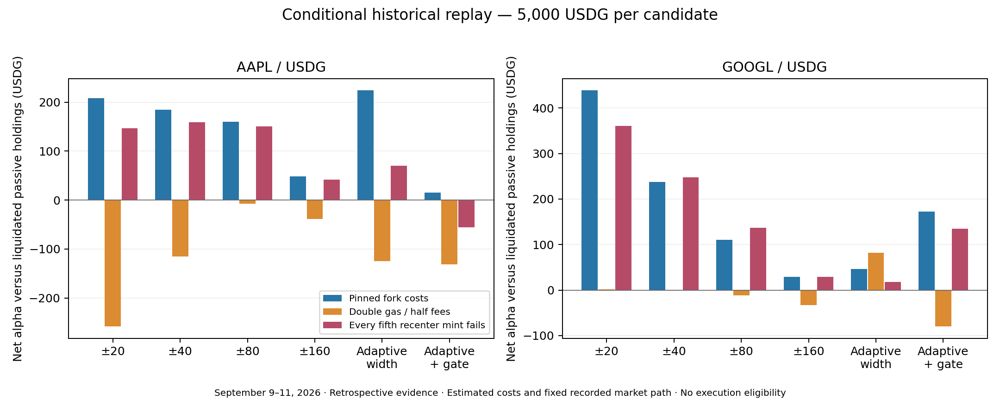

# Adaptive LP comparison — September 13, 2026

Follow-up: the [July 28–September 11 continuous study](../adaptive-lp-long-study-2026-09-13/README.md) materially changes the base-case ranking at 5,000 USDG. Read the short-window results below together with that broader capacity and weekly analysis; neither study establishes production eligibility.

The paper-inspired adaptive rules do not earn promotion in this study. Adaptive widths improve AAPL's base-case result slightly but lose substantially to the ±20-tick baseline on GOOGL. The economic gate reduces trading but leaves both assets outside their ranges for about 62% of invested time. Neither adaptive candidate produces positive combined alpha under the double-gas/half-fee scenario.

This is a conditional historical replay, **not realized profit or production eligibility**. The fee model retains recorded market flow and prices despite adding hypothetical liquidity. At 5,000 USDG, AAPL's adaptive position reaches 85.5% of existing active liquidity, making that assumption material. Historical reference, issuer and infrastructure eligibility are unavailable. No running policy or service was changed.

The originating [paper review](../lp-paper-review-2026-09-13.md) distinguishes the usefulness of adaptive LP optimization, option-payoff diagnostics and leverage research. This experiment implements a discrete, causal forecasting hypothesis inspired by the LP paper; it does not reproduce its continuous-time optimum.

## Later-window results

Each candidate starts with 5,000 USDG per asset. Alpha is terminal strategy cash minus the same acquired-and-liquidated passive portfolio. All values below are USDG after modeled gas and exact historical-depth swap quotes.

| Candidate | AAPL base | GOOGL base | Combined base | Combined 2× gas / ½ fees | Combined mint-failure stress |
| --- | ---: | ---: | ---: | ---: | ---: |
| Fixed ±20 ticks | 208.15 | 438.50 | 646.64 | -256.09 | 506.59 |
| Fixed ±40 ticks, validation-selected wider control | 184.41 | 237.33 | 421.74 | -115.03 | 406.93 |
| Adaptive width | 224.04 | 46.48 | 270.52 | -43.33 | 88.46 |
| Adaptive width + economic gate | 15.10 | 172.18 | 187.28 | -211.22 | 79.11 |

The combined column represents two independent 5,000-USDG portfolios. The test window is September 9 08:00 through September 11 19:30 UTC. It was locked for this run, but those dates had been inspected in other studies: it is **retrospective evidence, not an untouched holdout**. The separately reserved September 11 20:00–September 14 experiment was excluded.



The full grid includes ±80 and ±160 ticks; see [results.csv](results.csv) or [summary.json](summary.json). Raw monetary CSV fields are integer micro-USDG; time fields are milliseconds and ratio fields are ppm. The report also includes absolute NAV P&L, marked drawdown, deployed capital, exposure, range occupancy and rejection counts. Positive alpha can coexist with an absolute loss: GOOGL fixed ±20 under cost/fee stress has +1.96 alpha but -2.39 NAV P&L.

At base costs, AAPL recenters 128 times at ±20, 47 at ±40, 66 with adaptive width and 17 with the gate. Corresponding GOOGL counts are 72, 27, 20 and 12. The gate's lower gas bill does not compensate for its missed income and inventory path: AAPL spends 62.68% of invested time outside range, GOOGL 62.24%. The corresponding ungated adaptive figures are 1.53% and 0.61%.

Failure stress changes subsequent inventory and decisions, rather than subtracting a fixed penalty from base returns. It can improve an individual result by changing market exposure; that is not evidence that failures are beneficial. Adaptive AAPL alpha falls from 224.04 to 70.60, while fixed ±40 GOOGL rises from 237.33 to 247.95.

## Forecast evidence and decision

The fee forecast uses six hours of trailing fee growth and realized variance, at least two hours and 60 observations, and a ten-minute prediction horizon. It integrates range occupancy over three zero-drift diffusion scenarios. It does not forecast future liquidity, independent reference prices, price jumps or order flow.

Nonoverlapping ten-minute frozen-position probes compare predicted fee income with modeled subsequent income. The baseline uses the same trailing fee rate and dilution but assumes continuous range occupancy. In the retrospective test:

| Asset | Half-width | Probes | Mean absolute fee error, USDG | Error reduction versus trailing baseline |
| --- | ---: | ---: | ---: | ---: |
| AAPL | 20 | 336 | 2.0815 | 17.21% |
| AAPL | 40 | 336 | 1.5538 | 3.03% |
| GOOGL | 20 | 344 | 2.0885 | 2.52% |
| GOOGL | 40 | 344 | 1.2190 | approximately 0% |

Both assets' wider probes have essentially the same errors as the baseline. The narrow AAPL improvement is useful evidence that occupancy matters, but it does not validate the complete NAV forecast or economic gate. Probe endpoints use the last observation before the horizon, accepted only within 90 seconds; these are event-sampled targets rather than exact wall-clock settlements.

Keep these models as research candidates. The next evidence step is a newly frozen prospective shadow comparison with calibrated fee/occupancy forecasts, observed execution costs and capacity sensitivity. A per-asset choice of whichever rule wins this test would be retrospective selection and needs fresh evaluation. These results do not justify changing live widths, enabling leverage or adding an option hedge.

## Accounting and experiment definition

[plan.json](plan.json) freezes widths, dates, forecast settings and cost scenarios. Development covers September 6 10:00–September 8 08:00 UTC; validation covers September 8 08:00–September 9 08:00. The wider fixed control is selected only from 40/80/160 ticks using summed AAPL/GOOGL validation alpha at base costs, with wider ranges winning ties. Validation scores are 67.721479, 46.130425 and 40.096329 USDG respectively. [selection.json](selection.json) was written before computing the test metrics. No fitted parameter was changed after test inspection.

All six strategies are simulated separately for both assets, three phases and three scenarios: **108 portfolios**. Fixed strategies recenter outside range. Adaptive strategies choose from the same four widths at entry or when outside range by maximizing predicted terminal cash; the gate additionally compares the proposed action with retaining the actual inventory and range. Its required buffer is the greater of 50% of move gas and 25% of predicted fee income. It rechecks at fill. These coefficients are hypotheses, not estimated optima.

Decisions run on event blocks at least 30 seconds apart. Quote and fill must use different blocks and strictly later timestamps, with a 90-second TTL, frozen range and 50-bps price/slippage checks. Successful paths conserve exact token balances, carry idle funds and accumulated fees, and use the existing net-swap/redeployment solver. Inventory is never reset during a phase. Each phase is a separate experiment funded once. The benchmark spends half its starting cash acquiring the stock token at the same first source for all candidates and pays buy and terminal sell costs. Both strategy and passive are liquidated against the same terminal canonical book.

Gas is a USDG-valued liability paid from separately modeled native funds; it reduces NAV rather than swapping USDG each time. Exposure ratios can consequently slightly exceed 100% of net NAV. Swap fees and depth impact are included in quoted token outputs and are not charged again. No separate additive slippage penalty is used. Marked drawdown excludes the final synthetic liquidation; terminal P&L includes it.

| Estimated bundle cost, USDG | AAPL | GOOGL |
| --- | ---: | ---: |
| Entry | 0.178897 | 0.177373 |
| Recenter | 0.225140 | 0.221310 |
| LP exit | 0.117634 | 0.118088 |
| Passive acquisition | 0.052761 | 0.051335 |
| Passive liquidation | 0.050835 | 0.051112 |

These are asset-specific captured fork estimates with saved native-token valuation, not receipts from the historical actions. The passive exit uses the saved approval/sell components without position removal. A flat strategy with risky inventory is conservatively charged the full LP exit bundle. Successful estimates include the configured complete bundles, including their approval convention.

The second scenario doubles these costs and halves modeled fees, rerunning decisions. The third makes every fifth otherwise executable recenter fail after withdrawal and swap, charges the full bundle estimate as an explicit attempted-gas assumption, preserves the swapped token balances and waits ten minutes before funding recovery from them. Rejected preflight quotes consume no modeled chain gas. This stress does not estimate failure probabilities or cover every revert/outage path.

### Virtual boundaries

The existing historical replay stopped when an unrelated LP removed an initialized tick used as a hypothetical boundary. The new standalone research replay leaves canonical ticks untouched and computes overlap against each exact reconstructed swap step. It apportions post-protocol fees by rational input distance (inverse square-root-price distance for token0, linear distance for token1), then dilutes by existing plus hypothetical liquidity.

Full-step overlap matches the existing diluted fee math. Partial-step apportionment records lower/upper integer bounds, and accrual uses the lower bound. AAPL's base ±20 test has 83 partial segments and an 11-micro-USDG terminal-value apportionment gap. The tiny integer gap **does not bound counterfactual economic error**. Adding substantial liquidity would change price impact, flows and arbitrage; this model cannot reconstruct those responses. It resolves conditional accounting across missing boundaries, not the missing counterfactual market.

## Evidence and verification

Sources are the frozen `data/asset-expansion-2026-09-13` captures: AAPL 135,888 events and GOOGL 337,296 events, plus 300 independent history pages. All page and source hashes are checked. A separate guarded read-only capture supplied 1,792 missing non-swap block headers; every event now has a timestamp checked against its frozen block hash. No production database was written. Final canonical price, tick, active liquidity and both global fee-growth counters reconcile with the captured ending chain state on every pass. The full source extends beyond the evaluation period only for canonical reconciliation; later observations do not enter earlier forecasts or scores.

The supplemental timestamp SHA-256 is `821a87bc11499abad104af34d11ffd750f5e80d9f61a0fd1f21d2f4edffc8f2d`; the frozen plan SHA-256 is `78018e8c08a3ff29f754b611ffa15890d9cfa2ecc557cf24c6b4239731caf2f6`. [manifest.json](manifest.json) records source, fork, history and core code hashes. Detailed actions and scores remain in `data/adaptive-lp-study-2026-09-13/final/{development-validation,retrospective-test}.json`; small review artifacts are copied here. The original preflight and a run superseded by a fractional-tick forecast correction remain in separate directories and are not used in these results.

[artifact-hashes.json](artifact-hashes.json) additionally pins the original result files and post-run verification tools. Review JSON copies are pretty-printed and checked for semantic equality with their originals.

`npm run check` passes type checking and **479 tests**. Added cases cover partial-step allocation, protocol fees, tick removal, both token orders, causal forecasts, exact preservation of a fractional-tick starting price under zero volatility, delayed fills, expired quotes, partial failure with inventory-funded recovery, fee stress and the common passive benchmark.

The independent Python ledger verifier checks **108 portfolios, 1,690 actions, 78 partial failures and 25,189 economic scores**. It verifies quote chronology, action token conservation, gas sums, terminal identities and validation-only selection; see [verification.json](verification.json). It does not independently reimplement canonical swaps or forecasting.

The frozen-action reconstruction additionally attributes marked portfolio changes to the repository's market-session regimes and reconciles action starting balances, fee token totals, gas and terminal alpha. It shares canonical swap/position math, but never reruns the decision engine. Calendar crossings use an explicit mixed-boundary bucket, and terminal liquidation is separate. Session attribution is descriptive, with no regime-specific strategy selection.

[session-attribution.json](session-attribution.json) reconciles all 108 portfolios. In the later base-case window, regular-hours alpha for the gate is -68.87 USDG on AAPL and -30.88 on GOOGL, versus +87.79 and +69.05 for ±20. GOOGL's ±20 result also includes +287.11 overnight alpha. That concentration makes historical issuer/oracle availability particularly important: these unconditional market-path figures cannot certify that an actual guarded policy could earn those amounts. The later window has no weekend coverage; earlier development contains weekend and holiday observations.

Historical oracle/issuer/health states, funding availability and receipts remain unavailable. Observed block-event coverage is not proof of execution availability. All 108 rows are computationally valid and terminal quotes pass the configured checks, but `executionEligible=false` and `promotionEligible=false` throughout.

## Reproduction

From the repository root, use a new output directory; capture and replay refuse to overwrite saved evidence. The replay and report commands are offline. The metadata capture is only needed when reproducing source enrichment and requires the operator's existing read-only RPC/database configuration; no credentials belong in this note or Git.

```sh
export PATH=/root/conc-liq/.tools/node/bin:$PATH
node --import tsx scripts/adaptive-lp-study.mjs notes/adaptive-lp-study-2026-09-13/plan.json data/adaptive-lp-study-2026-09-13/reproduction
python3 scripts/verify-adaptive-lp-study.py data/adaptive-lp-study-2026-09-13/reproduction
node --import tsx scripts/attribute-adaptive-lp-study.mjs data/adaptive-lp-study-2026-09-13/reproduction
.tools/inventory-report-venv/bin/python scripts/render-adaptive-lp-study.py data/adaptive-lp-study-2026-09-13/reproduction data/adaptive-lp-study-2026-09-13/reproduction/report
npm run check
```

Implementation: [virtual fees](../../src/research/virtual-fees.ts), [forecast](../../src/research/adaptive-forecast.ts), [portfolio replay](../../src/research/adaptive-lp.ts), [runner](../../scripts/adaptive-lp-study.mjs), [ledger verifier](../../scripts/verify-adaptive-lp-study.py), [session reconstruction](../../scripts/attribute-adaptive-lp-study.mjs).
