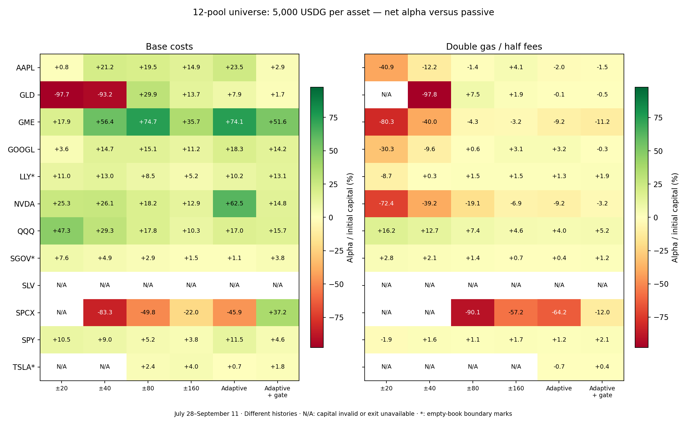
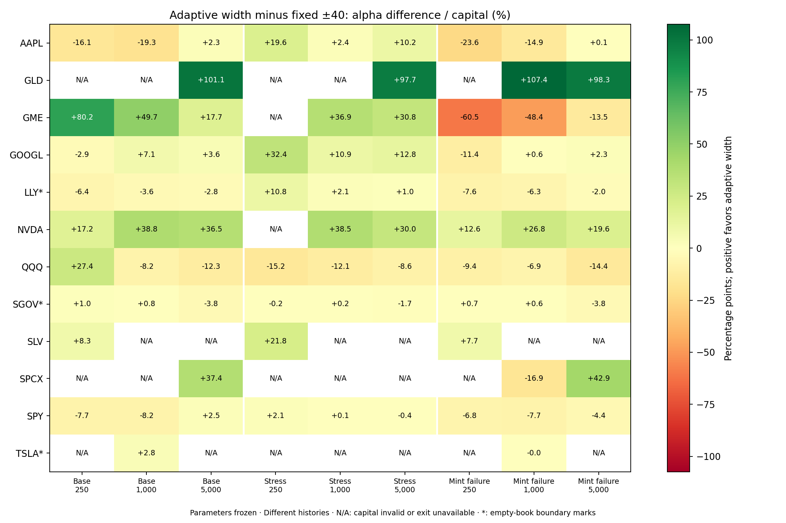

# Broader asset-universe validation — 13 September 2026

The twelve-asset extension qualifies the earlier AAPL/GOOGL result: **adaptive width is not a universal winner**. At 5,000 USDG it beats the original ±40 control on 7/10 comparable assets at base costs, but loses to fixed ±160 on 9/10 under double gas and half fees. The economic gate also becomes useful on some added assets, especially SPCX.

The broader replay exposes valuation and exit-capacity problems that must be addressed before policy promotion. All **648 portfolios** pass independent ledger and frozen-action reconstruction checks, but these remain conditional simulated outcomes. The universe, decision rules and evidence amendment were frozen before inspecting added-asset strategy returns; the source-quality diagnostics are explicitly post-hoc.

This extends the [long-history AAPL/GOOGL experiment](../adaptive-lp-long-study-2026-09-13/README.md) to all twelve pools that passed the earlier V3/USDG activity and 5,000-USDG slippage screen: AAPL, GLD, GME, GOOGL, LLY, NVDA, QQQ, SGOV, SLV, SPCX, SPY and TSLA. Inclusion is based on canonical replay and complete per-asset cost evidence. Missing evidence or unavailable common entry is reported explicitly; assets are never removed for poor strategy returns.

The [plan](plan.json) preserves July 28 00:00–September 11 19:30 UTC, with six hours of earlier warmup; fixed ±20/40/80/160 ticks, adaptive width and adaptive width with the economic gate; 250/1,000/5,000 USDG per asset; base costs, double gas with half fees, and every fifth recenter mint failing after removal and swap. Each portfolio keeps its inventory continuously across weeks. The earlier ±40 comparison remains the fixed control; there is no new parameter selection.

The [evidence amendment](evidence-amendment.json), recorded before new strategy results, handles later pool creation and cost-probe mechanics. A pool is seeded from verified archive state at the later of the common warmup boundary or its initialization block. Mint/burn history reconstructs initialized ticks, each checked against archive state. Events through that seed block are not applied twice. Capital waits in cash until the first event block that permits the largest-budget passive acquisition within 50 bps, shared across all sizes. Every asset's effective start and end are reported.

All upstream operations are read-only and bulk requests use the existing RPC health gate. Fork transactions occur only on isolated local Anvil instances. The twelve candidates have complete entry, restored-exit and recenter transaction stages. SLV's original uninitialized canonical boundaries do not invalidate the virtual-boundary fee model. TSLA's ±20 entry moved outside its intended range; one predeclared ±160 cost probe completed all transaction stages. Its wider probe supplies an explicitly approximate, width-independent cost scenario; replay widths and decision rules remain unchanged.

The data capture reconciles every indexed pool's raw logs with the existing database, and captures the other pools separately without changing the production indexer. Where the window overlaps the previous complete seven-day swap capture, its hash-verified canonical swap pages are reused and non-swap pool events are fetched separately. This preserves complete event reconstruction while avoiding repeated bulk downloads. All twelve canonical replays reconciled ending price, tick, active liquidity, global fees and protocol fee settings to archive state. The capture contains 7,003,875 events in 396 pages; 3,989,033 events from the six indexed pools also match database raw logs exactly. A separate check matches 43,439 swaps across all twelve assets against nine previously frozen HyperSync pages, including identities, raw data/topics, block hashes and timestamps. This is an independent-provider sample, not a second-provider replay of the entire period. AAPL and GOOGL results are reused only after proving identical raw event histories, seed and ending states, cost bundles and decision parameters.

## Results at 5,000 USDG per asset

All values below are USDG after modeled costs. Alpha compares the strategy with its own common passive acquisition and liquidation. Absolute P&L compares terminal cash with the initial 5,000 USDG. Asterisks flag the empty-book boundary marks discussed below. N/A means capital invalidation or an unavailable terminal comparison; full status and marked inventory values remain in [results.csv](results.csv).

| Asset | Fixed ±40 alpha | Fixed ±80 alpha | Adaptive-width alpha | Adaptive absolute P&L | Adaptive alpha, 2× gas / ½ fees |
| --- | ---: | ---: | ---: | ---: | ---: |
| AAPL | +1,057.91 | +975.86 | +1,174.69 | +1,337.52 | -100.11 |
| GLD | -4,660.53 | +1,495.94 | +395.41 | +305.19 | -6.59 |
| GME | +2,821.22 | +3,734.80 | +3,703.75 | +3,666.35 | -458.39 |
| GOOGL | +734.99 | +753.73 | +916.06 | +736.03 | +161.60 |
| LLY* | +649.55 | +422.82 | +511.88 | +427.45 | +62.83 |
| NVDA | +1,302.78 | +911.51 | +3,125.28 | +3,411.13 | -458.03 |
| QQQ | +1,462.62 | +888.21 | +848.23 | +830.66 | +200.15 |
| SGOV* | +242.78 | +143.52 | +53.67 | +49.26 | +22.23 |
| SLV | N/A | N/A | N/A | N/A | N/A |
| SPCX | -4,166.65 | -2,491.22 | -2,296.59 | -1,463.13 | -3,209.66 |
| SPY | +452.30 | +259.17 | +576.14 | +546.51 | +60.41 |
| TSLA* | N/A | +119.93 | +35.22 | +100.87 | -32.54 |

Adaptive width beats the original ±40 control on **7/10** comparable assets at base costs, including **5/8 newly added assets**. Its result is much less uniform against other fixed widths and under different stresses. Each denominator below requires both candidates to survive the frozen capital rule and have an executable paired terminal comparison. Source-quality flags remain present; these are conditional model comparisons.

| Comparator | Adaptive wins, base | Adaptive wins, 2× gas / ½ fees | Adaptive wins, every fifth recenter mint fails |
| --- | ---: | ---: | ---: |
| Fixed ±20 | 6/9 | 6/8 | 7/10 |
| Fixed ±40 | 7/10 | 6/9 | 5/10 |
| Fixed ±80 | 6/11 | 4/10 | 4/11 |
| Fixed ±160 | 7/11 | 1/10 | 8/11 |
| Adaptive + economic gate | 7/11 | 3/11 | 8/11 |

Under double gas / half fees, fixed ±160 beats adaptive width on **9/10** comparable assets, and the economic gate beats adaptive width on **8/11**. The broad result therefore supports retaining both wider fixed controls and the economic-gate candidate. It does not select one universal setting.

The added assets supply concrete counterexamples. GLD fixed ±80 earns +1,495.94 alpha versus +395.41 for adaptive width at base costs. QQQ favors fixed ±20 (+2,363.83) over adaptive width (+848.23). Conversely, SPCX adaptive width loses **1,463.13 USDG in absolute P&L**, while its economic-gate candidate gains **2,692.67** (+1,859.21 alpha). Under cost stress that gate retains +232.08 absolute P&L but has **−601.27 alpha**, below passive holding. Reducing churn, forecasting widths and retaining directional inventory are different mechanisms.

SPCX illustrates why the gate is not merely a gas-saving switch. Its base-case behavior at 5,000 USDG is:

| Candidate | Recenters | Modeled lifetime fees, USDG | Gas including exit, USDG | Average stock exposure / net NAV | Time outside range while invested |
| --- | ---: | ---: | ---: | ---: | ---: |
| Adaptive width | 1,189 | 5,940.88 | 265.76 | 52.46% | 2.85% |
| Adaptive + gate | 169 | 4,797.89 | 38.03 | 9.44% | 76.28% |

The 4,155.80-USDG absolute-P&L difference is much larger than the 227.74-USDG gas difference. The gate changes swaps, principal evolution and time spent mostly in quote inventory. Lifetime fees are valued at the ending source and do not form an exact additive P&L decomposition. This strengthens the case for inventory/exposure diagnostics from the hedging paper, without establishing an executable hedge or identifying the alpha residual as LVR.



## Added assets and capital size

This table excludes AAPL and GOOGL and keeps the original ±40 comparator. The median is the paired adaptive-minus-fixed alpha difference among comparable added assets. Omitted assets, source-quality flags, all comparators and both scopes are in [comparisons.json](comparisons.json).

| Capital per asset | Scenario | Adaptive wins / comparable added assets | Median alpha difference, USDG |
| --- | --- | ---: | ---: |
| 250 | Base | 5/7 | +20.83 |
| 250 | 2× gas / ½ fees | 3/5 | +5.20 |
| 250 | Partial mint failure | 3/7 | -16.95 |
| 1,000 | Base | 4/7 | +8.09 |
| 1,000 | 2× gas / ½ fees | 5/6 | +11.24 |
| 1,000 | Partial mint failure | 3/9 | -62.53 |
| 5,000 | Base | 5/8 | +503.19 |
| 5,000 | 2× gas / ½ fees | 4/7 | +47.72 |
| 5,000 | Partial mint failure | 3/8 | -144.31 |

Failure stress often reverses the comparison with ±40. At 5,000 USDG, adaptive width wins on only 3/8 comparable added assets and has a negative median difference, even though its summed difference is positive. A large avoided loss on one asset can dominate the sum. Choosing each cell’s historical winner would be new selection on these outcomes.

Across all 648 cases, **59 are capital-invalid** and **35 have unavailable alpha**, leaving **554 completed paired-return cases under the frozen rules**. Those two failure sets are disjoint. The 59 include 23 TSLA invalidations at an empty-book price limit; they require the valuation qualification below. Unavailable alpha occurs in 30 SLV cases and five TSLA cases. Computational completion does not establish historical reference eligibility, executable counterfactual flow, or reliable interim valuation.



## What this says about the paper-inspired forecast

The ten-minute occupancy-aware fee forecast improves mean absolute error relative to the trailing-always-active baseline most clearly at narrow widths. These are paired feasible probes at 5,000 USDG, not an independent sample of deployable trades. Counts differ by width. The marked assets retain the source-quality limitations below; their probes cannot validate a production estimator.

| Asset | Feasible ±20 probes | ±20 error reduction | ±40 error reduction |
| --- | ---: | ---: | ---: |
| AAPL | 2,351 | 9.83% | 1.93% |
| GLD | 1,428 | 26.61% | 15.14% |
| GME | 4,657 | 23.31% | 12.55% |
| GOOGL | 1,619 | 10.43% | 1.40% |
| LLY* | 1,032 | 15.20% | 3.54% |
| NVDA | 6,219 | 12.19% | 2.73% |
| QQQ | 1,562 | 5.32% | 0.44% |
| SGOV* | 566 | 22.40% | 0.00% |
| SLV | 601 | 10.78% | 0.92% |
| SPCX | 5,692 | 23.04% | 13.72% |
| SPY | 1,894 | 0.04% | 0.00% |
| TSLA* | 628 | 8.46% | 0.27% |

At ±160, the two forecasts are essentially identical except SPCX, where the error reduction is 1.43%. Forecasting missed fees is useful, but better fee error alone does not establish better incremental NAV decisions. The economic gate’s benefit also varies sharply by asset and costs. [forecast.csv](forecast.csv) retains all 144 size/asset/width cells, their counts and error measures expressed as per-probe means.

## Capacity of the hypothetical LP position

For the **5,000-USDG adaptive-width base cases**, the independent reconstruction classifies modeled fee tokens by our hypothetical position liquidity relative to existing canonical active liquidity in each fee-bearing segment. These are descriptive ratios, not admission thresholds or error bounds. Fees are valued at the ending source, consistently with the lifetime-fee metric.

| Asset | Adaptive-width fees earned above 10% of existing liquidity | Above 100% |
| --- | ---: | ---: |
| AAPL | 88.76% | 7.79% |
| GLD | 77.11% | 12.39% |
| GME | 85.45% | 6.65% |
| GOOGL | 76.17% | 0.46% |
| LLY | 70.63% | 0.00% |
| NVDA | 31.00% | 0.00% |
| QQQ | 57.85% | 14.24% |
| SGOV | 21.02% | 0.15% |
| SLV | 26.76% | 4.39% |
| SPCX | 68.28% | 2.89% |
| SPY | 93.11% | 3.47% |
| TSLA | 50.78% | 0.55% |

At 5,000 USDG, these positions often represent a material addition to the observed pool. Even SPCX’s favorable economic-gate result earns 65.28% of its modeled fees while our liquidity exceeds 10% of the existing amount. Liquidity dilution alone does not reconstruct how the added position would change swaps, price impact, routing or future volume. An apparently small fee-allocation rounding gap cannot bound that economic error.

The full [capacity.csv](capacity.csv) includes all sizes, candidates and scenarios, along with time-based ratios. Diagnostics remain available when terminal liquidation is unavailable; they do not supply the missing cash return. Time diagnostics for capital-invalid campaigns explicitly include later synthetic marks and cannot rank a valid managed campaign.

## Empty-book prices and valuation quality

A post-hoc [source-mark diagnostic](mark-diagnostics.json) scans the final canonical state of every event block after common benchmark availability. It reconstructs Swap post-state and Mint/Burn active-liquidity changes separately from the policy engine, verifies page hashes, and reconciles ending price, tick and liquidity for all twelve assets. This diagnostic does not change the frozen universe or any result.

| Asset | Time with zero canonical active liquidity | Time at a canonical price limit with zero liquidity | Context for the six 5,000-USDG base portfolios |
| --- | ---: | ---: | --- |
| GOOGL | 102 seconds | None | Before all first LP entries |
| LLY | 20 seconds | 20 seconds | Before all first LP entries; still part of trailing input history |
| SGOV | 14 seconds | 12 seconds | After all first LP entries |
| SPY | 6 days, 6:06:32 | None | Before all first LP entries; benchmark already holds stock |
| TSLA | 239 seconds | 239 seconds | Fixed ranges already invested; adaptive candidates still in cash |

The other seven assets have no such post-availability empty-book marks. Durations run until the next observed event block, without extrapolating beyond the final source; zero liquidity refers to the canonical pool, excluding our hypothetical position. LLY, SGOV and TSLA are marked with an asterisk in the figures, and comparison artifacts explicitly list boundary-mark assets in their denominators.

At **TSLA block 54,464,426**, September 4 18:04:22 UTC, the pool ends at minimum tick **−887,272**, square-root price **4,295,128,740**, and zero active liquidity. The condition lasts until 18:08:21. Fixed-range base entries occurred at 18:00:38–18:01:50; both adaptive entries occur only at September 5 00:32:40. The independent audit places **all 23 TSLA capital-exhaustion flags at this same block**. Base fixed-width marked drawdowns approach 100%, and several invalidated stressed campaigns later have positive synthetic terminal P&L. Such later values remain excluded from completed-campaign rankings. These 23 valuation-driven invalidations must be distinguished from the other 36 capital-invalid campaigns, and the delayed adaptive entry does not isolate width-prediction skill.

SGOV's limit-price episodes likewise produce approximately 100% modeled drawdown for all six 5,000-USDG base candidates. Those are **not validated economic drawdowns**. An empty book's boundary price is not an executable valuation of the stock token, and adding our own LP position would itself change the supposedly empty market path. Exact event reconciliation and integer arithmetic do not resolve either problem.

The fixed results are retained for auditability, with this source-quality qualification. The next guarded replay needs explicit handling of unavailable marks, independent historical reference evidence where available, and an entry-availability-matched fixed-width control. It must not silently treat an empty-book price limit as an ordinary stock-price observation. This also qualifies forecasts and weekly attribution: a transient bad mark can contaminate a trailing window even when the candidate was still in cash, and offsetting marked moves can disappear from a week's net change.

## Historical availability

Only GME, NVDA and SPCX can acquire the common benchmark from the July 28 start. The other portfolios retain cash until their own verified availability block. These dates describe the common benchmark; strategy entries can occur later because of quote, range and forecast requirements. No capital is reset at weekly boundaries.

| Asset | Common benchmark available (UTC) | Replayed events |
| --- | --- | ---: |
| AAPL | 2026-08-05 07:43:28 | 309,698 |
| GLD | 2026-08-29 00:38:36 | 240,046 |
| GME | 2026-07-28 00:00:06 | 1,010,197 |
| GOOGL | 2026-08-04 11:24:26 | 456,699 |
| LLY | 2026-09-03 14:07:57 | 96,684 |
| NVDA | 2026-07-28 00:00:01 | 2,404,083 |
| QQQ | 2026-08-29 15:49:01 | 469,156 |
| SGOV | 2026-09-02 01:25:09 | 75,805 |
| SLV | 2026-09-04 19:52:03 | 34,338 |
| SPCX | 2026-07-28 00:00:17 | 1,743,775 |
| SPY | 2026-08-12 21:07:48 | 109,345 |
| TSLA | 2026-09-04 17:57:33 | 54,037 |

The requested window is approximately 45.8 days. Four pools become usable only in September; their longer-window results still cover only seven to ten days. The table counts events after each verified seed block, excluding twelve initialization/Mint events already represented by the six later-created pool seeds. [availability.csv](availability.csv) and [coverage.json](coverage.json) retain availability and observation-gap details.

## Limits on interpretation

The retained catalogue contains 306 V3/USDG pool rows spanning 192 symbols. The frozen screen excludes 255 rows whose tick grid cannot represent the original ±20 control and 155 with zero current active liquidity; 120 rows meet both exclusions. Four more fail the 5,000-USDG purchase-slippage screen: BABA, MU and TTWO at fee 500, plus SPCX at fee 100. SPCX's separate fee-500 pool is included, leaving twelve included pools overall. This tests the existing fee-500 strategy family; it does not compare other fee tiers or establish that the excluded assets cannot support another strategy. Exclusion reasons are recorded per pool in [universe.csv](universe.csv).

The September 13 catalogue and liquidity screen are retrospective relative to the evaluation dates. This is a broader conditional sensitivity study, not an unbiased historical universe or untouched out-of-sample test. The screen's excluded pools remain in `universe.csv`; current zero liquidity does not establish historical inactivity, and a failed 5,000-USDG screen does not rule out a smaller position. The original September 13 reference snapshot rejected GLD, LLY and SGOV for missing feeds, and QQQ/SPY for unacceptable held-reference age. These pools remain useful for conditional offline research; including them does not establish paper or live eligibility. Different asset histories, correlated stock/ETF exposures, and a shared chain limit statistical independence. Returns are not annualized.

The original model limitations remain: recorded flow and future market prices are held fixed despite hypothetical trades and added liquidity; virtual fees dilute by our added liquidity but do not solve the market's counterfactual response; September 13 fork gas bundles and valuation are applied to earlier history and all sizes; historical issuer, oracle and infrastructure eligibility are unavailable. Decisions and quote delays sample event blocks rather than production wall-clock polling. Quiet event gaps can make forecasts or quotes unavailable. Net alpha is versus a common passive benchmark that spends half the starting USDG on the stock token, holds the remaining cash, and liquidates at the ending source. It differs from absolute cash PnL and includes differences in inventory exposure.

The partial-mint-failure scenario charges the full recenter bundle as an explicit attempted-gas assumption, retains the post-swap inventory, and waits ten minutes before inventory-funded recovery. Rejected preflight quotes consume no modeled chain gas. This is a deterministic stress path, not an estimated failure probability or coverage of every outage/revert. A failed-mint scenario can outperform the base case by changing subsequent exposure and actions; that does not establish that failures are beneficial.

Invalid portfolios are counted and excluded from completed-return rankings. Pairwise comparisons use explicit denominators. All-asset and added-asset-only results are separated so the original two assets cannot conceal how the new assets behave. A summed cross-asset result combines separately funded portfolios with the stated capital in each asset; it is not a shared-budget allocation or a simulation of concurrent transaction execution. `executionEligible=false` and `promotionEligible=false` throughout.

An unavailable terminal quote leaves the relevant cash return unavailable; marked NAV is retained as an inventory valuation, not a substitute for executable cash. Strategy and passive liquidations are recorded independently, and alpha requires both. `gasPaidQuote` covers modeled campaign actions. `terminalExitCostQuote` remains the frozen exit-cost estimate even when the liquidation quote fails, so `totalGasWithExitQuote` in an unavailable row must not be read as a completed exit or a realized expense. Weekly/session attribution adds an exit charge only when that strategy liquidation is executable.

SLV provides a concrete exit-capacity example. At 5,000 USDG, its passive sale fully fills but has a **203.95-bps** output shortfall, exceeding the frozen 50-bps allowance; the 1,000- and 250-USDG passive positions have **45.44-bps** and **15.14-bps** shortfalls and pass. These shortfalls include the quoted swap fee and price impact. A [separate canonical reconstruction](passive-exit-SLV.json) reproduces all 54 reported passive terminal values. At 5,000 USDG, all 18 alpha comparisons are unavailable: 17 strategy exits fail the limit and every passive exit fails it. At 1,000 USDG, all twelve fixed-width cases have unavailable strategy exits, while both adaptive candidates can exit in all three scenarios. At 250 USDG, all eighteen alpha comparisons are available. Initial entry capacity and terminal liquidation capacity are distinct, and the final inventory mix matters.

## Next research step

The [reviewed optimal-provision paper](../lp-paper-review-2026-09-13.md) remains useful for forming width and fee-occupancy candidates, and the hedging paper is useful for exposure diagnostics. The broader evidence does not support replacing the current research controls with one universal adaptive rule. Borrowing or leverage does not resolve the valuation and exit-evidence gaps identified here.

The next bounded experiment should first distinguish **unavailable valuation from exhausted capital**, preserve inventory through empty-book periods, and use independently justified historical marks where available. It should evaluate entry, recenter and terminal capacity from the actual token inventory, with size-specific transaction-cost evidence. A failed quote remains an unavailable action rather than a zero-cost or marked-price fill.

Then compare the same frozen width grid with fixed-width controls that share the adaptive candidates' entry and forecast-availability requirements. Use observation timing that matches the intended guarded worker and retain missing-input states explicitly. Compare both absolute P&L and passive-relative alpha alongside stock exposure, so waiting in cash or remaining one-sided is distinguishable from better width selection. Freeze the resulting design before evaluating the separately reserved prospective evidence; this retrospective universe is not a fresh holdout.

## Reproduction and verification

The final verification passes for **648 portfolios, 145,431 actions, 8,152 partial-mint failures and 2,788,541 economic scores**. All twelve frozen-action reconstructions verify starting action balances, final marked NAV, fee-token totals, gas, weekly/session attribution and independently recomputed strategy/passive terminal quotes. The auditor never reruns policy decisions; it shares the exact swap, position and virtual-fee math. Canonical reconstructions consume 7,003,863 post-seed events, while the raw capture contains 7,003,875 events.

The retained raw evidence, fork proofs and optimization certificate are prerequisites; they are not all included in Git. The commands below document the pipeline from the repository root using the local Node runtime. Completed output manifests are protected: use a separate prepared artifact directory for a fresh rerun rather than overwriting the original evidence.

```sh
export PATH="$PWD/.tools/node/bin:$PATH"
node --import tsx scripts/capture-adaptive-lp-universe.mjs data/live-pilot-runtime.env data/adaptive-lp-universe-study-2026-09-13
node --import tsx scripts/run-adaptive-lp-universe.mjs data/adaptive-lp-universe-study-2026-09-13 --memo --workers=5
python3 scripts/diagnose-adaptive-lp-universe-marks.py data/adaptive-lp-universe-study-2026-09-13
node --import tsx --import ./scripts/lp-tick-memo-hook.mjs --import ./scripts/lp-empty-quote-hook.mjs scripts/diagnose-adaptive-lp-universe-exits.mjs data/adaptive-lp-universe-study-2026-09-13 SLV
python3 scripts/verify-adaptive-lp-universe.py data/adaptive-lp-universe-study-2026-09-13
.tools/inventory-report-venv/bin/python scripts/render-adaptive-lp-universe.py data/adaptive-lp-universe-study-2026-09-13 notes/adaptive-lp-universe-study-2026-09-13
python3 scripts/package-adaptive-lp-universe.py data/adaptive-lp-universe-study-2026-09-13 notes/adaptive-lp-universe-study-2026-09-13
```

The first command needs the existing private runtime configuration and is read-only upstream. The remaining commands are offline. The runner freezes inclusion, verifies saved independent-provider samples and retained control identities, runs a bounded number of jobs concurrently, then reconstructs the frozen actions with a separate auditor. Completed runs are preserved; individual scripts reject overwriting their manifests. Raw log pages, fork proofs, action ledgers and score records stay under the data directory. The report contains compact review artifacts and their hashes, without credentials.

[verification.json](verification.json) records the independent ledger checks; [reconstruction.json](reconstruction.json) records all frozen-action reconstructions and their input hashes. [summary.json](summary.json), [weekly.csv](weekly.csv), [capacity.csv](capacity.csv) and [comparisons.json](comparisons.json) retain the detailed results. [capture-completed.json](capture-completed.json), [source-verification.json](source-verification.json), [run-manifests.json](run-manifests.json), [execution-manifests.json](execution-manifests.json) and [artifact-hashes.json](artifact-hashes.json) retain provenance. The verifier's optional `--await-reconstructions` flag allows ledger checks to finish while canonical audits are still running; it publishes its result files only after every audit passes.

Cost-proof reproduction uses `scripts/lp-asset-fork-check.mjs READ_ONLY_ENV ARTIFACT_DIRECTORY SYMBOLS [HALF_WIDTH_TICKS]`. The optional width defaults to the unchanged original ±20 ticks. TSLA's wider proof is retained separately under `wide-cost-probe/`, alongside the failed original ±20 proof. The common USDG gas valuation is the pinned September 13 valuation from the original long study.


## Equivalent runtime optimizations

The larger universe uses two explicit Node process hooks: a bounded cache for the pure `sqrtRatioAtTick` integer calculation, and a quote shortcut that jumps to the same price limit once active liquidity is zero and there are no further initialized ticks in the swap direction. Skipped empty bitmap words consume no input and produce no output or fees. The shortcut is restricted to the original fee-500, spacing-10 model and fewer than 10,000 initialized ticks, preserving the original quote step-limit behavior.

The source files and policy parameters remain unchanged. Before enabling these hooks, validation checked all **1,774,545 valid ticks**, cached reads and eviction, invalid tick inputs, **20,138 quote cases** including partial fills, empty depth and real asset seeds, and a full AAPL 250-USDG control replay. The complete 18-portfolio result over 309,698 events is byte-identical to the retained original, including every action, economic score and forecast metric. All **479 working-tree tests** pass both normally and with the hooks enabled, and the normal typecheck passes. The quote harness compares valid results and error types/codes; Node's generated assertion excerpts differ for eight deliberately invalid negative-amount calls under the native TypeScript loader. These inputs are outside the replay's valid quote domain.

The `--memo` driver verifies the [optimization certificate](optimization-certificate.json) before loading either hook and records hook/certificate hashes for each executed run and reconstruction. The hooks are confined to these offline processes. Original control results are retained through their separately verified source identity.

To regenerate the optimization checks in a fresh artifact directory, run `verify-lp-tick-memo.mjs` with the tick hook, `verify-lp-empty-quote.mjs` with both hooks, and the original `adaptive-lp-long-study.mjs AAPL 250000000` with both hooks and a separate output root. `certify-lp-optimizations.mjs` requires exhaustive checks and byte identity before creating the certificate. Exact paths and hashes are retained in the certificate and per-run execution manifests.
