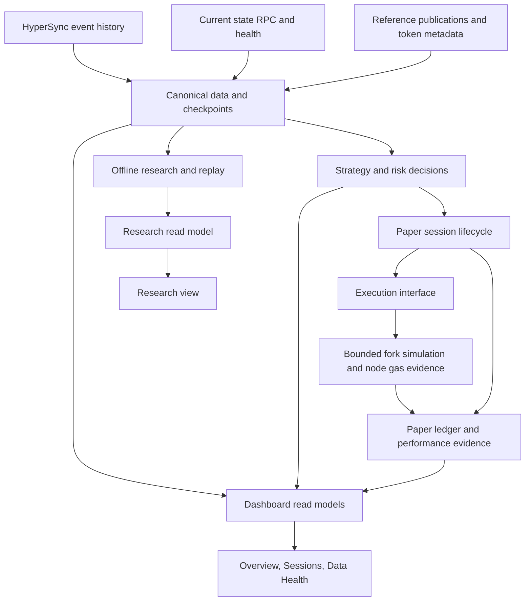

# Architecture review and staged refactoring plan

Reviewed September 7, 2026 against commit `3fe5070`, the running dashboard,
read-only PostgreSQL queries and systemd status. This is a plan; no application
code, database schema, configuration or running service was changed.

## Recommendation

Refactor incrementally around operational boundaries. Keep one TypeScript
repository, PostgreSQL, the existing systemd workers and a lightweight web UI.
The project has useful foundations: exact integer math, canonical source
checks, persistent paper sessions, transaction simulation and explicit missing
evidence. Preserve those investments.

The pressure to refactor comes from shared runtime responsibilities and
inconsistent contracts, rather than file count alone. There are currently 190
source TypeScript files / 33,112 lines, 38 npm scripts, 34 unit-test files and 59
declared tables. Research milestones accumulated faster than the live operating
model became consolidated. A broad rewrite would delay the paper evidence we
need without resolving that problem by itself.

## Current operating evidence

At the dashboard snapshot **11:05:43 UTC**, session **4 was already closed**.
The paper timer, checkpoint timer, RPC monitor, tail and dashboard were active;
an active timer does not imply an active position. The CLI advances an existing
session and does not automatically create another after closure.

- Entry source: 09:12:47 UTC, block 56,717,784.
- Exit signal: recorded 10:30:48 UTC, reason
  `paper_current_risk_evidence_unavailable`.
- Exit source: 10:31:31 UTC, block 56,764,616; result saved 10:32:04 UTC.
- Closed paper NAV: **996.580017 USDG** on 1,000 initial paper USDG.
- Paper P&L: **−3.419983 USDG**; alpha versus the current passive-holding
  benchmark: **−1.290882 USDG**.
- 72 holding intervals / 6,131 indexed swaps; estimated LP fees 0.134903 USDG;
  estimated gas charged to the paper ledger 1.183336 USDG.

The dashboard reported canonical source evidence and successful entry/exit
simulation runs. These are paper results, not mainnet receipts or evidence of
profitable live execution. The shorter holding period was a risk-triggered
exit, not the scheduled six-hour limit. No new session was started in this
review.

The reason is too broad to establish the precise failure from the journal
alone. `paper/reference.ts:101` reads the globally latest risk attempt and
maps an unfinished attempt, failure, absent validation or stale evidence to
the same reason. Read-only inspection found attempt 5359 started at
10:30:47.777 and completed at 10:30:48.019, immediately before the exit signal
was persisted at 10:30:48.074. Overlap with collection/validation is a plausible
explanation, not a proven root cause: current canonicality rows can be updated
after the decision, and the exact latest-risk input seen by its transaction
was not preserved in that journal entry. This is a concrete case for better
decision evidence and explicit treatment of temporary data unavailability.

## Findings that justify changes

| Priority | Evidence | Architectural consequence |
| --- | --- | --- |
| First | `storage/schema.ts` is 2,314 lines; 24 source files import its shared SQL. Combined schema text contains 29 `ALTER TABLE` statements. Checkpoint startup even calls three migrations concurrently (`strategy-checkpoint.ts:151`). | Routine workers can request schema locks on unrelated tables. Move DDL to an explicit deployment step. The lock incident in the continuous-paper note demonstrates actual impact. Paper ticks already avoid this DDL; other recurring paths still execute it. |
| First | Services invoke npm scripts running `node --import tsx` in the mutable checkout. `paper_sessions` and execution runs record policy hashes but no build identity. | An unchanged policy hash does not establish unchanged implementation. Pin releases and record build/config identities before another implementation changes a running experiment. |
| First | `paper/reference.ts` combines SQL and policy evaluation, imports the canary calendar, and produces one broad latest-risk failure. Tail and the targeted checkpoint service both collect risk. | Give collection attempts an explicit source/scope and assign collector ownership. Preserve the exact evidence selected for each decision. Distinguish token/reference risk from collector health. |
| Next | `paper/engine.ts` imports `transaction-engine.ts`, which imports runtime values back from `engine.ts`. The executor interface exposes return types derived from concrete simulation functions. | Extract stable domain types/constants and explicit execution result types; retain the existing executor boundary and remove the concrete implementation dependency. |
| Next | `DashboardRepository.snapshot()` loads 19 top-level sections in one repeatable-read transaction. Historical research is queried every ten seconds even when collapsed in the UI. | A research query failure or delay affects the entire live view. Split read models by purpose, while retaining coherent source identities within each live snapshot. |
| Next | `dashboard/focus.ts` mixes future canary readiness with the active paper reference policy. Frontend headings reflect both milestones. | Present one active-policy decision, with diagnostic and future-mode checks separately identified. The dashboard should explain the worker's decision, not reconstruct a competing policy. |
| Later | Dashboard readers load hardcoded dated JSON paths under `notes/`; reference unit tests load two dated evidence files there. Integration/browser harnesses also live in dated evidence directories. | Separate reusable harnesses and fixtures from immutable research outputs. Register evidence explicitly instead of making runtime behavior depend on a historical note's pathname. |
| Later | Service environment-file order differs; services import a sibling project's environment. Checked-in RPC defaults still include Blockreq, while the active override uses Alchemy. README/package introduction still emphasizes the original observer. | Make configuration ownership, provider roles and operating instructions reproducible. Fix default/config drift without copying endpoint credentials into the repo. |

Three sequential local API reads took **370, 513 and 397 ms**, each about
84.5 KB; the earlier snapshot was 87.9 KB. This is a small observational sample,
not a load benchmark or evidence that PostgreSQL needs replacement. Sequential
queries on one transaction client are appropriate; parallel queries on that
same client are not the proposed optimization. Server-side query/lock timeouts
and independent research reads are more useful than adding cache infrastructure.

## Target responsibilities

These are dependency boundaries within the current repository, not a proposal
for six network services or an immediate directory migration.

1. **Canonical data:** event ingestion/reorg handling, replay coverage,
   checkpoint collection, reference publications and provider health. HyperSync
   remains the history route; current-state RPC serves checkpoints and simulated
   actions. Alchemy/Chainstack retain bounded, configured provider roles. The
   refactor does not require an archival subscription.
2. **Strategy decisions:** pure evaluations over explicit inputs and versioned
   policy. Keep 24/7 evaluation and bounded held references. Market schedules
   affect reference interpretation; they should not become an accidental
   blanket trading-hours restriction during extraction.
3. **Paper lifecycle and execution:** orchestration owns intents, later-source
   fills, retries and session transitions. Execution owns contract simulation
   and gas evidence. Preserve short database transactions, advisory exclusion
   and post-simulation cancellation/canonicality checks. Do not add a funded
   execution adapter as part of this work.
4. **Ledger/performance:** one definition of inventory, fees, costs, NAV and
   passive-holding comparison, consumed by both worker and dashboard. Keep
   source measurements, simulation outputs and estimates distinguishable.
   Preserve existing benchmark semantics during extraction; a different
   benchmark belongs in a separately versioned experiment.
5. **Research:** historical replay, calibration and alternative policy ranking
   consume stored data without becoming required dependencies for current
   paper decisions or the live dashboard.
6. **Infrastructure/presentation:** small database/RPC/config utilities and
   typed dashboard contracts. Domain calculations should not import PostgreSQL,
   CLI entrypoints or dashboard code. Avoid a catch-all shared module.

Start with contracts for `StrategySpec`, `DecisionEvidence`, `ExecutionResult`
and `PerformanceSnapshot`, extracted from existing structures. Each decision
needs its policy/build identity, checkpoint block/hash, risk attempt/run IDs,
validation timestamp, evaluation time, availability status and specific
reason codes. Include units and calculation method on monetary measurements.
These are a few explicit types, not a generic multi-chain strategy framework.

## Dashboard plan

Keep the existing visual style and chart functionality. The inspected desktop
capture is readable, but the first paper panel carries lengthy mechanics,
rehearsal details and diagnostics alongside performance. Organize navigation
around operator questions rather than the chronology of implementation.

| View | First information shown | Details on demand |
| --- | --- | --- |
| Overview | Paper mode; active/closed/invalid session; worker health separately; net P&L and LP alpha; current action or exact blocking/exit reason | Source freshness, active reference basis and timestamp, policy summary |
| Sessions | Session list, entry/exit timeline and outcome, position/range, NAV versus passive holding | Fee/cost breakdown, frozen order, attempts, source blocks and simulation evidence |
| Data Health | Index/replay lag, checkpoint age/coverage, reference and validation freshness, RPC health | Collector attempts, provider request counts where measured, recovery history and unavailable metrics |
| Research | Dated backtests, calibration and historical receipt studies | Method, scope, limitations and immutable artifact links |

Use one small live snapshot endpoint, paginated session details and research
endpoints loaded when visited. Display each response's source times; a healthy
HTTP request does not make an old checkpoint fresh. Retain exact integer/raw
values at the API boundary and format only in the UI. Start by splitting the
current JavaScript into ES modules with a typed or schema-validated API contract;
choose a larger UI framework only if later requirements justify the migration.

Persist an exit's initiating reason through the closed-session summary. Session
4 currently ends with an `exit` observation whose reasons are empty; the trigger
is in the previous observation. Surface that cause directly. Make local time
and timezone clear, retaining UTC/source blocks in details. On mobile, prioritize
status, net result, alpha and the current reason before the audit tables.

## Delivery sequence and acceptance criteria

Each row is a bounded reviewable change set; split larger rows into small PRs.
Do not combine a policy change with a behavior-preserving extraction.

| Order | Scope | Completion evidence |
| --- | --- | --- |
| 0: before runtime changes | Preserve the closed session and characterize its decision/exit path. Add reusable isolated DB and browser harness entrypoints; capture exact selected risk evidence in a subsequent instrumentation change. | Entry → holding → exit, missing/stale/in-progress risk, duplicate tick, cancellation and reorg fixtures reproduce current behavior. Existing policy hashes and integer ledger outputs stay unchanged. |
| 1: deployment and DB boundary | Versioned migration ledger and one explicit migrator; replace worker migrations with schema compatibility checks. Build immutable releases; record build/config identity for new sessions. Standardize project-owned environment precedence. | No worker-start or tick DDL; clean-install and existing-schema upgrade tests; concurrent collector/paper/dashboard audit passes; incompatible schema fails clearly; a source edit cannot alter a pinned session's code. |
| 2: live contracts | Extract domain types, reference evaluator and ledger calculations; separate evidence readers from decisions; remove the engine import cycle and concrete executor return-type coupling. Scope collector identities and document which scheduler owns each collection. | Golden fixtures produce identical decisions, intent contents, costs and P&L; worker/dashboard share policy evaluation; every new decision records the exact selected evidence and specific failure category. |
| 3: dashboard | Split operational/research queries, then split frontend modules and add Overview/Sessions/Data Health/Research navigation. Add explicit query budgets and keep raw evidence on demand. | A failed research query cannot break Overview; closed session and worker status are distinct; stale/held/missing evidence renders correctly; desktop/mobile and API contract checks pass; measured live query latency/payload do not regress under the same fixture and workload. |
| 4: consolidation | Move reusable audit harnesses/fixtures into stable test paths, register dated evidence metadata, shorten README to architecture and operating entrypoints, retain detailed research notes. | Existing evidence links still resolve; documented commands reproduce audits in isolated schemas; runtime no longer requires hardcoded dated note paths; legacy sessions remain readable. |

For migrations, baseline the existing schema after verification; do not rerun
destructive history or rewrite old evidence. Introduce additive changes first,
with a declared compatibility window for the previous release. Roll back by
selecting the prior compatible release rather than reversing ledger history.
Once release pinning exists, rehearse changes in an isolated schema/worktree
and activate them at a documented session boundary.

Separately investigate the temporary-risk-unavailability exit policy before
starting another long experiment. Decide explicitly how `wait`, `no new entry`,
`exit requested` and `performance invalid` differ, including what exit is safe
when evidence is missing. Do not silently replace latest-attempt checks with
last-successful checks or relax freshness limits as a refactor. Preserve issuer
pause, corporate-action, identity and canonicality protections. Session 4's
evidence is a regression fixture and a reason to improve observability, not
enough evidence to prescribe a new grace interval.

## Keep outside this refactor

Microservices, a message broker, Kubernetes, a new database, a new archival
service, a multi-chain plugin system and a funded-wallet adapter have no
demonstrated requirement here. Likewise, avoid deleting legacy replay/paper
modes merely to reduce line count: preserve readers for their immutable records.

Additional realism work—counterfactual liquidity dilution, range-crossing fee
coverage, intervening transactions and inclusion/MEV effects—remains strategy
validation work. Isolate these assumptions and label them accurately now; alter
the model only through separate tests and versioned experiments. Refactoring
should make those improvements easier to verify, not claim they are completed.

## Evidence and follow-through

- [Continuous-paper implementation and lock incident](paper-continuous-2026-09-07.md)
- [Transaction simulation and remaining realism limits](paper-transaction-simulation-2026-09-07.md)
- [Inspected desktop capture from the earlier open session](paper-continuous-evidence-2026-09-07/live-desktop.png)
- Live verification: `/api/dashboard`, read-only risk-attempt/session queries,
  systemd active-state checks and the source paths cited above.

The first implementation slice should be the deployment/migration boundary,
preceded by the minimal session regression fixtures. Dashboard work follows the
shared decision contract; visual restructuring can be prepared independently.
This review did not restart services, change policy or launch another session.
