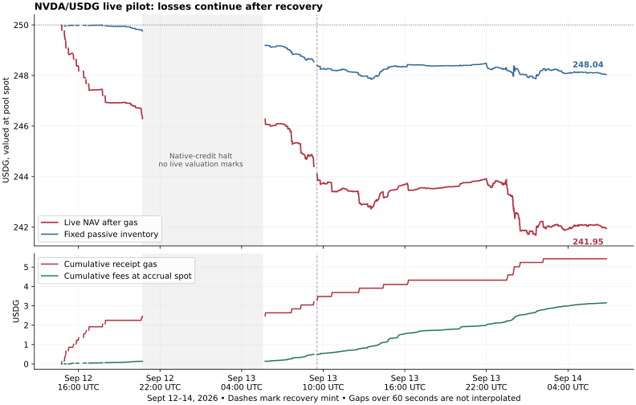

# NVDA/USDG live performance — 14 September 2026

The live pilot is operating, but has lost **8.049817 USDG (3.2199%)** over its first **40.41 hours**, using the dashboard's pool-price valuation. It trails the fixed passive inventory by **6.086395 USDG**. Valuing both portfolios at the same policy-accepted independent reference makes the result slightly worse: **8.223952 USDG lost**, with **6.192692 USDG underperformance**. The loss is not explained solely by the initial deployment incidents: performance remains negative after the successful mint recovery.

The accounting cutoff is block **62,607,582**, hash `0xfeb853e24ca0ece79766e5f72111b300112757beb758b03c265181425b06b8a9`, **2026-09-14 06:49:17 UTC / 09:49:17 Vilnius**. The repeatable-read ledger snapshot was captured at 06:49:36 UTC. Campaign `f8affe19-4d89-4132-b214-d67e5ad81331` began September 12 at 14:24:30 UTC. This report concerns the real 250-USDG NVDA campaign; paper campaigns are separate.

| Metric at the fixed cutoff | USDG |
|---|---:|
| Initial strategy capital | 250.000000 |
| Managed wallet + NFT principal + claimable fees, before gas | 247.373620 |
| Recorded gas, valued at each receipt's oracle prices | −5.423437 |
| Net NAV at pool spot | **241.950183** |
| Absolute P&L | **−8.049817** |
| Fixed passive inventory at the same pool spot | 248.036578 |
| Net alpha versus that inventory | **−6.086395** |
| Pre-gas alpha versus that inventory | −0.662958 |
| Maximum observed drawdown from initial capital | 8.325680 / 3.3303% |
| Lowest observed NAV | 241.674320 |

The fixed benchmark is **155.194454 USDG + 0.432011537030058711 NVDA**, retained after the campaign's first successful swap at 14:46:19 UTC on September 12. It is not a dynamically rebalanced benchmark or the composition of every subsequent mint. Differences in stock exposure therefore contribute to alpha; the entire shortfall must not be described as impermanent loss. NAV excludes the **49.927111 USDG reserve** and subtracts gas funded from the separate ETH balance. Fees are already included in NAV; gas is deducted once. Future withdrawal/liquidation costs are unavailable, so this is marked NAV, not a realizable cash-exit quote.

Fee income, measured by changes in cumulative collected and claimable token fees and valued at each observation's pool spot, totals **3.150421 USDG**. The actual fee-token counters are **1.281251 USDG + 0.007024941453403963 NVDA collected**, plus **0.150623 USDG + 0.000955778867583025 NVDA claimable**. Revaluing all those historical token amounts at the terminal pool spot gives **3.146983 USDG**; claimable fees alone are **0.356026 USDG**. The small difference between accrued-value income and terminal-value fees is valuation, not missing fees. No fee-counter regression beyond one raw unit was found.

Receipt-based swap shortfall against the pre-transaction pool spot is **1.680995 USDG** across 29 swaps. This diagnostic includes the effects of swap fees, execution price and movement since preparation. It is already embedded in inventory/NAV and must not be charged again. Across the full campaign, fees cover about **58% of gas**, or **44% of gas plus this swap shortfall**. An arithmetic decomposition of the 8.049817 loss is +3.150421 fees −5.423437 gas −1.680995 swap shortfall −4.095806 residual price/inventory effects. The residual is not an independently identified causal estimate of adverse selection or impermanent loss.

| Mined action | Count | Receipt-valued gas, USDG |
|---|---:|---:|
| Approval | 112 | 1.379909 |
| Swap | 29 | 1.157604 |
| Successful mint | 20 | 1.918651 |
| Withdrawal/collection | 19 | 0.921800 |
| Reverted mint | 1 | 0.045473 |
| **Total** | **181** | **5.423437** |

Approvals account for **62% of mined transactions** and **25% of gas**. Ten additional intents were cancelled unsigned and consumed no gas. The single mined revert is the previously diagnosed mint-slippage incident. A cancelled preflight is not another mined failure.

The recovery release materially improved operational continuity, but it has not established a profitable strategy:

| Pool-spot comparison window ending at the cutoff | NAV change | Passive change | Alpha change | Gas | Fee income | Swap shortfall |
|---|---:|---:|---:|---:|---:|---:|
| Last approximately 24 hours | −4.145475 | −1.136732 | −3.008743 | 2.785770 | 2.961273 | 0.630309 |
| Since successful recovery mint, Sep 13 09:32:35 UTC | −2.153224 | −0.365643 | −1.787581 | 2.136720 | 2.658483 | 0.479815 |
| Since the mark at Sep 13 23:59:59 UTC | −0.701383 | +0.054129 | −0.755512 | 0.614341 | 0.827488 | 0.150305 |

After the recovery mint, fees exceeded gas plus measured swap shortfall by only **0.041948 USDG**, before inventory-price effects. Pre-gas alpha improved by **0.349139 USDG**, but **2.136720 USDG** of gas turned that into **−1.787581 USDG** net alpha. That makes both management overhead and changing stock exposure relevant. The recovery window starts after the replacement mint's receipt cost; it does not hide that cost from whole-campaign totals. Period boundaries use the last actual observation at or before the stated time, without interpolating missing marks. These rows use pool spot throughout; a reference-valued historical alpha series has not been constructed here.

There were **14 distinct recenter operations: 13 completed and one diverted into a risk exit**. Resuming the interrupted mint after recovery is part of its original recenter, not a new operation. Completed recenter latency, from the first persisted recenter transition through replacement-mint reconciliation, had a **153.562-second median** and cost **0.214290 USDG of gas on average**, excluding swap shortfall. The longest took **15 minutes 53 seconds**, including the mint halt and deployment recovery; ordinary completed recenters took approximately **1 minute 50 seconds to 4 minutes 50 seconds**. These timings include the controller's confirmation/reconciliation delay and do not establish exact crossing-to-execution latency.

The policy is **40 raw ticks wide, approximately 0.4% total price width**, with all available strategy inventory allocated. It is not a ±2% LP range. Two replacement positions were withdrawn only **48 seconds** and **28 seconds** after minting. At the cutoff, NFT **1160438** had range `[222580, 222620)`, approximately **214.891692–215.752937 USDG/NVDA**, while pool tick was **222619**. Its total managed inventory, including claimable fees, was **9.055698 USDG + 1.108937263107707505 NVDA**: approximately **96.34% NVDA exposure** at the independent reference. A narrow range can become almost entirely stock before crossing its boundary; liquidity outside its range does not earn fees. See [Uniswap's explanation of active liquidity](https://developers.uniswap.org/docs/get-started/concepts/liquidity-providers/concentrated-liquidity).

Receipt timestamps establish **28.615 hours with nonzero NFT liquidity**, about **70.8% of the campaign's elapsed time**. This is custody time, not a measured percentage of time earning fees. The ledger contains **10,351 valuation marks**, but gaps over 60 seconds total **10.761 hours**, including the long native-credit halt and management intervals. Exact out-of-range time, continuous drawdown and missed fee opportunity are therefore unavailable from these marks alone. No zero-out-of-range conclusion is drawn from the absence of out-of-range marks.

Operational history includes the September 12 startup/risk exits, one explicit operator exit, an **8-hour 49-minute 55-second native-credit halt**, and a **12-minute 58-second mint halt**. The source remains the sealed recovery release `ea156df3f87e8538d6e13b7367589f590b6d97f9622f413a100abce0113ee079`, commit `c2116750c587ceef1e04c4c340fe0f875f1594e3`. The live service has no automatic restarts since its September 13 deployment. No new persisted hard halt or risk exit occurred between the successful recovery and the accounting cutoff. Short observation pauses do still occur.

Independent valuation used the on-chain NVDA and USDG feed states at the same pinned block. The resulting reference was **214.749558347204334453 USDG/NVDA**, versus **214.90658705825763** at pool spot: a **+0.0731% deviation**, within the deployed ±5% guard. The NVDA update was **September 14 00:22:59 UTC**, about **6 hours 26 minutes** old. It passed the policy's heartbeat-based reference checks; it is not a tick-fresh equity quote. The same reference gives **241.776048 USDG net NAV**, **247.968741 USDG passive value**, and **−6.192692 USDG alpha**. This valuation does not change the direction of the conclusion.

Read-only verification re-fetched all **181 receipts**, checked their canonical block hashes and gas, and matched wallet token deltas and one-step nonce advances. Consumed nonces are exactly **0–180**, with no duplicates or gaps. Receipt gas sums to **0.002160669708874 ETH**. Initial native funding plus the separately recorded **0.000008505303167004 ETH external credit**, less that gas, equals the cutoff wallet's **0.002754835594293004 ETH** exactly. The external credit is funding, not earnings. Fresh pinned chain reads reproduced the complete saved wallet/NFT snapshot and NAV, and confirmed all **19 retired NFTs** still belonged to the operator with zero liquidity and zero tokens owed. Current health at 06:51:06 UTC was healthy, one block behind the reference quorum and zero seconds of lag.

Trading continued during the audit. A later status snapshot at **06:53:06 UTC** showed replacement NFT **1162154**, holding with no monitor reasons, cumulative gas **5.616719 USDG**, and recorded NAV **241.595594 USDG** at source time **06:52:58 UTC**. This later ordinary recenter is outside the fixed-cutoff totals above. It is not evidence of custody failing to reconcile at the original cutoff.

The evidence supports keeping this result classified as a losing execution pilot. The next policy comparison should measure wider ranges and lower stock concentration against the current narrow range using this observed recenter latency, approval overhead, real swap deltas and a common independent reference. Approval efficiency deserves investigation because it creates both cost and delay. These are candidates for historical comparison, not proven profitable settings or changes authorized by this analysis. The roughly 40-hour weekend/overnight sample does not support annualization or conclusions about regular-session performance.

The investigation changed no service, policy, controller state or live position and submitted no transaction. Evidence is in the ignored `data/live-performance-2026-09-14/` bundle: `ledger.json`, `chain-verification.json`, `analysis.json`, `timeline.json`, and extraction/analysis/verification/render scripts. [Compact results](summary.json) and the [exportable chart](performance.svg) accompany this report. All accounting checks ran against the fixed snapshot; unrelated working-tree changes were preserved.
