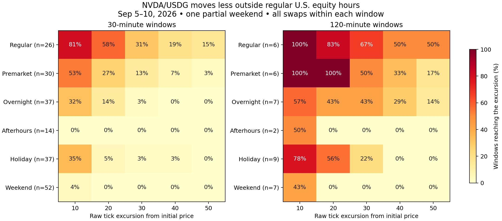

# Market hours, inventory limits, and the 55% allocation test

The existing data supports smaller NVDA/USDG movements outside regular U.S. equity hours, particularly on the sampled weekend and immediately after the equity close. That makes inventory pressure less frequent, but does not remove it: five completed paper sessions hit the inventory cap while their entire holding interval was overnight. The separate 55% allocation test eliminated inventory exits in the modeled episodes but did not consistently improve net performance. Prioritize a test by trading hours before promoting a lower allocation across all hours.

This is a retrospective research result. The running paper policy remains an 80% allocation ceiling, 60% hard inventory cap, and ±20 raw tick half-width. Session **55** and **55% allocation** are different identifiers. The four-strategy service remains stopped. No live transactions were sent.

## Evidence and clock definitions

The new capture covers **September 5, 12:32:48 UTC through September 10, 14:34:04 UTC**, with **4,926 canonical checkpoints and 601,996 pool events**. The event index and replay cursors cover the final source, and price, tick, liquidity, and both global fee-growth accumulators reconcile at every checkpoint. The pool is NVDA/USDG, fee 500, `0xd4eb21209c4d6093f80b5b84f5c45cc093ea14a3`.

The classification uses `America/New_York`, including the September 7 Labor Day holiday, with regular trading 09:30–16:00, premarket 04:00–09:30, after-hours 16:00–20:00, and overnight 20:00–04:00. These follow the [Nasdaq calendar and trading hours](https://www.nasdaq.com/market-activity/stock-market-holiday-schedule). The existing entry-readiness code's buffered 09:35–15:55 window is intentionally not used for this economic classification. In September, add seven hours for Vilnius: after-hours is 23:00–03:00 and overnight is 03:00–11:00.

Weekend means Saturday/Sunday in New York; the holiday is a separate category. There is only **one partial weekend, one holiday, two complete regular sessions, and part of Thursday**. The more recent, fully audited paper cohort contains no weekend entries. We can test weekend price behavior, but cannot claim observed weekend paper profitability or a measured weekend inventory-exit rate.

The analysis uses source block timestamps, not event ingestion times or unchanged oracle marks. It includes every recorded swap between each pair of window boundaries. A reversal between checkpoints therefore still counts as a range excursion. Higher pool ticks mean lower NVDA prices because USDG is token0.

## Price-movement test

Windows are consecutive and nonoverlapping within each horizon, ending at the first checkpoint at least 30 or 120 minutes after their start. End overshoot is at most six minutes. Windows spanning a market-hours boundary are excluded, with classification checked every minute. The main screen also excludes internal checkpoint gaps over ten minutes. Weekend and weekday median half-hour durations are similar: 30.99 and 30.73 minutes respectively.

| Regime | Half-hour windows | Median absolute endpoint move | 95th percentile absolute endpoint move | Reached a 20-tick excursion |
|---|---:|---:|---:|---:|
| Regular | 26 | 0.1290% | 1.0073% | 57.7% |
| Premarket | 30 | 0.0751% | 0.3187% | 26.7% |
| Overnight | 37 | 0.0406% | 0.1665% | 13.5% |
| After-hours | 14 | 0.0170% | 0.0731% | 0.0% |
| Holiday | 37 | 0.0496% | 0.1769% | 5.4% |
| Weekend | 52 | 0.0181% | 0.0778% | 0.0% |

The median endpoint move was about **seven times smaller on the weekend** and **three times smaller overnight** than during regular hours. The inference is descriptive; windows from the same market episode are dependent and these are not confidence intervals.



These are excursions from the initial raw tick, not exact position exits: a real position's boundaries are rounded to tick spacing, entry changes the price slightly, and its inventory cap can bind before a range boundary. Twenty raw ticks are approximately a 0.2% price move; they are not twenty tick spacings.

Over two hours, the main screen reaches 20 ticks in **5/6 regular**, **3/7 overnight**, **6/6 premarket**, **0/2 after-hours**, and **0/7 weekend** windows. Sample counts are small, especially after-hours. Duration matters: a calm half-hour does not establish that a position can remain unattended all night.

Sparse checkpoint sensitivity is material. Because the complete event history still spans internal checkpoint gaps, a second screen permits those gaps while retaining the endpoint timing and calendar checks. It expands the weekend to **74 half-hour windows**, still **0/74** reaching 20 ticks, and **19 two-hour windows**, of which **1/19** reaches 20 ticks. This confirms the broad short-horizon result while exposing a longer-horizon exception. The complete-events screen covers 39.38 weekend hours; the stricter screen covers 31.95. Both versions and every window are included below.

Lower movement also comes with less fee opportunity. In the main half-hour windows, pool quote turnover averages approximately **2.31 million USDG/hour during regular hours**, **0.85 million overnight**, **0.71 million on the weekend**, and **0.65 million after-hours**. This is observed pool turnover, not our fees, realizable profit, or evidence that trading is economic after costs.

## What actually happened to inventory

The previously reconciled cohort comprises 50 completed sessions, 5–54. Holding time is split into market-hours groups; exit signals are classified at signal time. The signals and holding times are reproduced in `hours-summary.json`.

| Signal regime | Observed holding hours | Inventory exit signals | Signals per holding hour |
|---|---:|---:|---:|
| Regular | 8.04 | 8 | 0.995 |
| Premarket | 11.13 | 6 | 0.539 |
| Overnight | 12.55 | 5 | 0.398 |
| After-hours | 7.28 | 0 | 0.000 |

The five overnight inventory sessions are **23, 43, 45, 48, and 50**. Each entered and completed its holding interval entirely within overnight hours. Their holding durations range from about 16 to 55 minutes. Therefore the problem is not solely positions carried over from an active regular session. Earlier chain and risk exits also censored these sessions, so the rates are descriptive, not clean estimates for the newly deployed holding policy.

The [prior inventory audit](../lp-inventory-study-2026-09-10/README.md) found that 47 of 50 entries could reach the 60% cap before the NVDA-heavy range boundary, typically 6–17 ticks from entry under its stated reference-price sensitivity. Smaller off-hours moves help, but ±20-tick range survival does not prove cap survival. A ten-tick excursion occurred in 32% of overnight half-hours even though only 14% reached twenty ticks.

## Completed allocation experiment

The paired test uses the same starting cash, recorded quote checkpoint, delayed fill checkpoint, and fixed range for each of the 50 completed sessions. Starting cash follows each actual session, approximately 947–1,000 USDG. It regenerates entry sizing at an 80% and 55% allocation ceiling, freezes the output minimum at quote time, uses exact historical swap depth at fill, and mints with integer position-manager rounding.

All **50 baseline entries exactly match** the recorded swap inputs, minimum outputs, actual outputs, post-swap prices, minted liquidity, minted token amounts, and idle balances. All **50 candidate entries** pass the corresponding modeled fill checks. Candidate fees follow every crossed segment, retain fractional fee remainders, and dilute the historical fee share for added liquidity.

The primary diagnostic isolates the 60% inventory cap. It models delayed exit on a later source but does not reconstruct operational chain eligibility. A separate variant adds the old conservative checkpoint guards. Neither is a reconstruction of the new 30-block holding tolerance. There is one placement per episode, no recenter or reentry, and a common-horizon depth liquidation for comparable ending cash.

| Horizon | Matched episodes | Inventory exits, 80% → 55% | Mean ending-cash advantage of 55% | Worst paired difference | Mean out-of-range minutes, 80% → 55% |
|---|---:|---:|---:|---:|---:|
| 30 minutes | 49 | 19 → 0 | +0.195 USDG | −1.089 USDG | 1.34 → 3.64 |
| 120 minutes | 48 | 26 → 0 | −0.014 USDG | −5.904 USDG | 12.34 → 32.39 |
| 360 minutes | 45 | 36 → 0 | −0.476 USDG | −11.081 USDG | 39.91 → 141.51 |

For the two-hour diagnostic, mean absolute PnL is **−1.024 USDG at 80%** and **−1.039 USDG at 55%**. Mean alpha versus each allocation's entry-token passive-holding benchmark is **−0.076** and **−0.347 USDG** respectively. A lower allocation also changes initial NVDA exposure, so these benchmarks are not interchangeable. None of the paired episode sums should be presented as a campaign return.

The guard-constrained two-hour variant slightly favors 55% by **0.049 USDG on average**, but its worst paired difference is still **−5.904 USDG**. The sign depends on the horizon and guard assumptions. In pure after-hours two-hour episodes, 55% loses an average **0.177 USDG** relative to 80%, with zero inventory exits in either branch; there are only three overlapping episodes. In pure overnight two-hour episodes, its mean advantage is **0.086 USDG**, but median difference **−0.089 USDG**, across thirteen episodes. These samples support further testing, not optimization claims.

Costs are explicit sensitivity inputs: each session's frozen entry/exit fork gas estimates are reused equally across allocations, with a second common profile from the new 55% rehearsal. Every branch pays one entry and one exit including terminal liquidation; therefore common gas largely cancels in paired differences. This does **not** establish a historical candidate-specific cost curve or repeated-turnover gas savings. Hypothetical trades do not alter the subsequent recorded pool path. Terminal liquidation is a valuation convention, not proof an exit could execute then under every guard.

A separate fresh **55% fork rehearsal** quoted at **14:43:07.349 UTC**, then entered from source block **59483547** after the quote. It successfully bought NVDA, minted range **222430–222470**, removed liquidity, sold back to cash, and cleared residual allowances. Its pinned Nitro estimates are **0.266653 USDG entry gas** and **0.178544 USDG exit gas**. These are local fork estimates, not mainnet receipts or a forward fee-income result. Idle balances after mint include **446.792463 USDG** and **0.025670049568417359 NVDA**; both count when evaluating inventory. The running paper position was not modified by this rehearsal.

The new evidence changes the earlier recommendation: **55% is a useful risk-budget candidate, not a demonstrated performance improvement.** Avoiding a cap exit can leave a one-sided position outside its range for much longer. An hours restriction and an inventory policy solve different parts of that problem.

## Next experiment

Use the next unobserved weekend, September 12–13, and subsequent off-hours as a prospective validation period, while keeping parameter changes separate from market-hours selection. Existing indexing already collects the required market data; no second strategy service is necessary.

1. Keep weekend, holiday, after-hours, overnight, premarket, and session transitions separate. Freeze ±20 ticks and the current 80%/60% allocation/cap baseline for the comparison; retain 55% as the paired counterfactual.
2. Evaluate both 30-minute and two-hour episodes. Include an explicit policy for the end of the allowed trading window, with removal and cash-exit costs. The present descriptive screen excludes transition windows and cannot establish how to exit before reopening.
3. Judge inventory exits per LP-hour alongside time in range, fees per allocated USDG-hour, net alpha, absolute PnL, downside tails, and total action costs. A low exit count alone is insufficient.
4. Prefer weekend and immediate after-hours observations for the first focused validation. Keep overnight separate because its actual cap exits and longer-horizon excursions remain material. Do not widen the hard cap on this evidence alone.

This note records a proposed next validation. It does not install an hours restriction, switch the active allocation, or restart the stopped four-strategy comparison.

## Dashboard repair and operational verification

The dashboard API error was a release compatibility problem. The dashboard still ran sealed build `f30da7e8…`, whose strict paper schema rejected the new `usdgHeartbeatGraceSeconds` field in session 54 and `holdingPolicy` in session 55. Parsing the latest policy failed in dashboard focus before a snapshot could be returned, producing HTTP 500 `dashboard_query_failed`. The paper worker itself was active.

Only `conc-liq-dashboard.service` was switched to compatible sealed build `95a464c4…`, already used by the paper worker. The previous unit was saved locally, then systemd reloaded and the dashboard restarted. At **14:33:37 UTC**, `/api/dashboard` returned HTTP 200, session 55 open, and valid campaign history. A later check at **14:51 UTC** again returned HTTP 200 with session 55 advancing and valid accounting. A oneshot paper service normally becomes inactive between timer ticks; that alone is not a stopped session.

The reusable read-only preflight now checks all persisted paper policies, an optional candidate policy, database schema compatibility, and a complete dashboard snapshot before rollout:

```bash
.tools/node/bin/node scripts/check-dashboard-release.mjs RELEASE data/runtime-refactor.env [CANDIDATE_POLICY]
```

It rejects the old build for sessions 54 and 55 and passes the deployed build for all 55 persisted policies. Run it against the intended dashboard release before enabling a worker policy with new fields. This is a deployment preflight, not a hook already wired into every activation path.

## Reproduction and validation

Raw captures stay in ignored `data/lp-allocation-55-2026-09-10/`; digests and sizes are in [source-manifest.json](source-manifest.json). The prior paper/market captures remain in `data/lp-inventory-study-2026-09-10/`. Environment files contain private configuration and are not part of the report.

```bash
.tools/node/bin/node --import tsx scripts/capture-lp-hours.mjs data/runtime-refactor.env 2026-09-05T00:00:00Z 2026-09-10T14:35:00Z OUTPUT.json
python3 scripts/analyze-lp-hours.py CAPTURE.json PAPER_SOURCE.json OUTPUT_DIRECTORY
python3 scripts/analyze-lp-hours.py --complete-events CAPTURE.json PAPER_SOURCE.json SENSITIVITY_DIRECTORY
.tools/node/bin/node --import tsx scripts/probe-lp-allocation.mjs data/runtime-refactor.env 550000 FRESH_PROOF.json
.tools/node/bin/node --import tsx scripts/compare-lp-allocation.mjs PRIOR_CAPTURE_DIRECTORY FRESH_PROOF.json COMPARISON.json
.tools/inventory-report-venv/bin/python scripts/report-lp-hours-allocation.py data/lp-allocation-55-2026-09-10 notes/lp-hours-and-allocation-2026-09-10
python3 test/lp-hours-analysis.test.py
```

The fresh probe necessarily uses a new source if repeated. The capture and comparison commands refuse to overwrite existing raw outputs. The report renderer expects the frozen filenames used here, including `allocation-comparison-v2.json`.

Verification includes 50 exact recorded-entry matches, 50 accepted candidate entries, 568 paired comparisons, independent arithmetic and aggregation checks, fork balance/gas reconciliation, window duration and nonoverlap checks, four calendar/reversal/gap/transition tests, and 27 focused dashboard/inventory/holding tests. See [verification.json](verification.json), [allocation-summary.json](allocation-summary.json), [allocation-pairs.csv](allocation-pairs.csv), [hours-windows.csv](hours-windows.csv), and the [PDF chart](tick-excursions.pdf).
