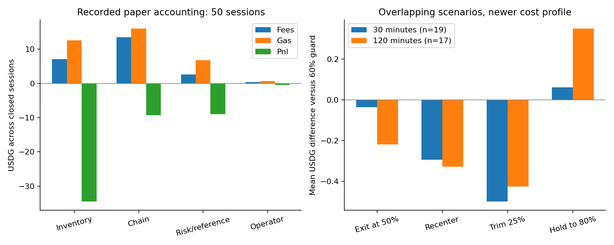
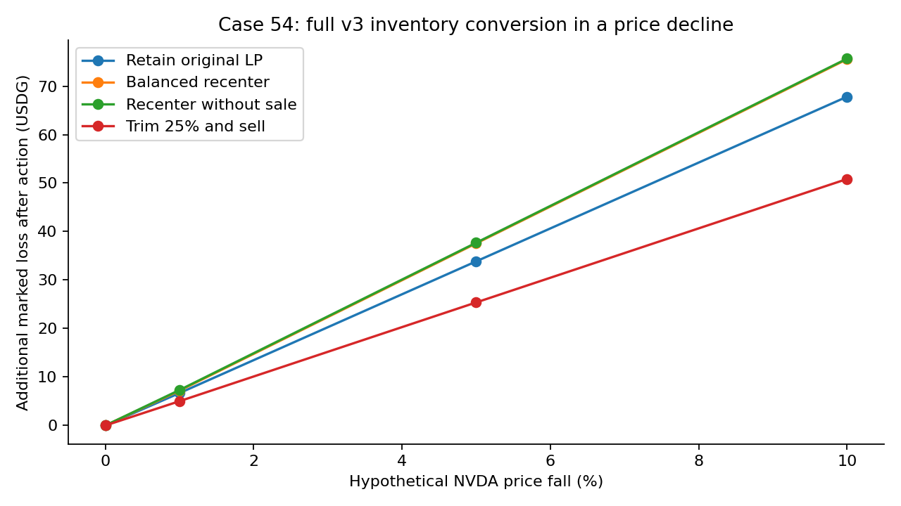

# Active LP inventory management: evidence, costs and next design

**10 September 2026.** NVDA/USDG, fee 500, paper trading only. Historical capture: **12:44:41 UTC / 15:44:41 Vilnius**. Operational verification: **13:18:11 UTC / 16:18:11 Vilnius**. Amounts below are USDG unless stated otherwise.

## Decision

**Keep the current paper campaign running, retain the 60% hard inventory threshold for now, and make allocation and turnover the next design problem.** The evidence does not establish an optimal cap, width or automatic rebalance rule. It does establish that treating a range reset as inventory management is inadequate: a reset can leave NVDA exposure unchanged, or reduce immediate exposure while increasing exposure to a larger subsequent decline.

The approved operational work is complete. Session **55** received the new 30-block holding policy through the ordinary cash handoff from session 54. A real risk-validation interruption then exercised the new pause and recovery path without an exit or duplicate charge. The four-strategy service remains disabled.

The research now has four independently executed, costed actions from identical historical inventory: full exit, balanced recenter, recenter without selling, and a 25% liquidity reduction followed by sale of the collected NVDA. The last action retains 75% of the original LP and costs about half as much as a full recenter. However, indiscriminate early trimming still loses on average in the tested recent-cost scenarios. A cheaper feasible action needs an economic reason to execute.

Three findings drive the proposed improvement plan:

- **Allocation and cap conflict mechanically.** In 47 of 50 recorded entry portfolios, a hypothetical adverse move reaches 60% exposure before the NVDA-heavy range boundary. Seventeen of 19 actual inventory signals occurred inside the range.
- **Turnover is expensive.** The 50 completed sessions earned 23.53 in fees against 36.09 in estimated gas and 21.22 in entry/exit execution drag. The campaign lost 53.18 from its original 1,000.
- **Waiting can help, but increases risk.** Raising the modeled cap to 80% improved average two-hour outcomes by 0.35 per episode, with a worst relative result of −1.75. This short, overlapping weekday sample cannot justify accepting that additional exposure for weekends.

Read the [spreadsheet](inventory-study.xlsx) for all session and episode rows, [machine-readable summary](study-summary.json) for assumptions and aggregates, and [source manifest](source-manifest.json) for frozen input hashes. The two figures are supported by spreadsheet tabs and CSVs.

## 1. Handoff and first live holding checkpoint

The activation artifact records **12:34:57.032 UTC**, parent 54 and successor 55. Session 54 exited normally; successor funding is exactly **946.816524**, equal to the parent's net cash. The successor policy is immutable and explicitly contains:

| Setting | Active value |
|---|---:|
| Holding lag tolerance | 30 blocks |
| Transient chain pause budget | 60 seconds |
| Risk-proof retry budget | 30 seconds |
| Confirmation depth | 64 on participating nodes |
| Earning range | ±20 raw ticks; 40 total |
| LP allocation ceiling | 80% |
| Inventory exit threshold | 60% |
| Independent price deviation band | ±5% |
| Reentry cooldown | 600 seconds |
| USDG heartbeat grace | 1,800 seconds |

The runtime build is `95a464c4442302aa72e351ac8afd43b2eb173520f05ebb8f9b39abfe1c9de77a`; policy hash is `da12490d5751103a5e33bce1970906c8482cfb0671f4ac393f8dba4a9caa46ba`. A fresh read validated every funding and execution-evidence link from sessions 5 through 55. The paper timer was enabled and active; the health service was healthy at lag zero. The comparison service was inactive and disabled, and its ledger remained at SHA-256 `f74ad69c5bf344d7a1748984dd51f1421b36a2a63fb4cf9345290671ed049bc3`. These are runtime observations, not conclusions from an old deployment note. [1](operations-checkpoint.json)

Session 55 was open when continuous observation began at 12:47:34 UTC. At **13:00:52.917**, stale canonical-validation evidence started a risk pause. The saved transition cleared at **13:01:08.955**, about **16.0 seconds** later. A monitor sample during the pause verified that position accounting, costs and NAV had not changed at checkpoint 4834: NAV **944.620578**, cumulative session gas **0.868343**. No exit reason was latched. At **13:01:40.917**, accounting resumed across the verified interval from block **59421999** to **59422602**, and later marks advanced normally. [2](holding-observation-extract.json)

At the final 13:18:11 UTC checkpoint, session 55 remained open at NAV **945.245007**, with the same **0.868343** session gas and no exit attempts. The continuous audit observed it for about 30 minutes; all funding and evidence ancestry checks passed again. [13](final-operations.json)

This verifies one real transient risk pause, unchanged accounting during that pause, and recovery under the deployed policy. It does not claim that a natural 30-block chain incident or an expired hard incident occurred during this checkpoint. The 30-inclusive/31-exclusive boundary, sustained fault, restart, hard safety and full-interval accounting cases remain covered by focused tests. An isolated PostgreSQL lifecycle run additionally passed pause-before-RPC, unchanged accounting, persisted incident clocks, interval resume, no duplicate fills/costs, explicit validation retry, hard issuer exit and historical evidence revocation.

## 2. What the completed paper sessions actually earned

The immutable source includes **50 completed sessions, 5–54**, plus session 55 waiting at the research capture boundary. The canonical market reconstruction covers **2,988 checkpoints and 245,683 events**, from 8 September 09:00:34 through 10 September 12:43:30 UTC. Recorded entries, exits, swaps, mint rounding, fee accrual, NAV and hold comparisons reconcile across all completed sessions: **2,287 recorded marks** match the replay exactly. The independent Python accounting check also passes. [3](replay-parity.json) [4](accounting-confirmation.json)

| Primary exit group | Sessions | Fee value | Estimated gas | Entry + exit drag | Net session PnL |
|---|---:|---:|---:|---:|---:|
| Inventory | 19 | 7.073 | 12.571 | 10.167 | −34.509 |
| Chain | 21 | 13.458 | 16.019 | 7.295 | −9.290 |
| Risk/reference | 9 | 2.659 | 6.792 | 3.509 | −8.945 |
| Documented operator upgrade | 1 | 0.342 | 0.707 | 0.255 | −0.440 |
| **Total** | **50** | **23.532** | **36.088** | **21.225** | **−53.183** |

Exit groups identify the recorded primary reason. They do not establish that the reason caused all PnL in that row. Inventory sessions include the price path before the trigger, LP conversion, entry costs and the delay before liquidation. The present count of nine risk/reference exits is broader than the six older risk-only incidents discussed previously; these are different capture boundaries and evidence cohorts.

Only **four** completed sessions had positive absolute PnL; **six** had positive session-specific alpha. At the historical capture, campaign cash was **946.816524** from **1,000**, and the original common holding benchmark was **985.773280**. Campaign alpha was therefore **−38.956756**. Adding per-session alpha gives a different number because each session resets its benchmark inventory; that sum is not campaign alpha.

The signed accounting bridge is:

| Component | USDG contribution |
|---|---:|
| Session benchmark market movement | −9.890556 |
| Entry execution drag | −9.819585 |
| LP inventory versus session holding | −9.511193 |
| Marginal fee value | +23.531598 |
| Exit execution drag | −11.405378 |
| Gas | −36.088362 |
| **Net** | **−53.183476** |

The 0.000032 difference between marginal fee value in this bridge and summed displayed fee marks comes from valuation/rounding conventions. It is retained explicitly. Gas figures are saved fork estimates charged in the paper ledger; they are not receipts from funded mainnet transactions.



The average historical gross fee rate over actual holding time was approximately **0.60 USDG per active hour**. A 2.03 recenter equals roughly 3.37 hours of that entire gross income. This is a cost-scale comparison, not an expected payback period: retaining the old position can earn fees too, so only incremental benefit can justify the extra action.

## 3. Inventory, earning range and reference guard are separate controls

Define total NVDA units as the NVDA in the LP, idle NVDA and uncollected NVDA fees. Reference-valued exposure is:

`NVDA units × independent reference price / net portfolio value`

Net value includes both tokens and the policy's cost deductions. Moving tokens out of an NFT does not remove them from this numerator. Burning liquidity without a sale changes where inventory sits; it does not by itself hedge it.

The pool's token ordering matters: USDG is token0 and NVDA is token1. A higher raw pool tick means a lower USDG price per NVDA. Moving toward the upper raw-tick boundary converts the LP toward NVDA. At the opposite boundary it converts toward USDG. This makes the two sides economically asymmetric for an unhedged strategy.

Uniswap's documentation confirms that liquidity earns within its range, becomes one asset outside it, and resumes earning if price returns. A raw tick is approximately a 0.01% price step. Thus our ±20 ticks are approximately ±0.20%, subject to tick-grid centering; the ±5% independent reference band is a much wider eligibility constraint. It is not an earning width or a promised maximum portfolio loss. [5](https://developers.uniswap.org/docs/get-started/concepts/liquidity-providers/concentrated-liquidity)

For each of the 50 recorded entries, I held liquidity, idle balances, initial fees and deductions fixed, and moved the price toward the NVDA boundary while preserving the initial pool/reference ratio. **47 portfolios reached 60% exposure before that boundary**, after **6–17 adverse ticks from entry**. The three exceptions were materially underallocated entries 8, 9 and 42. This is a mechanical sensitivity calculation, not a simulated future policy.

The actual records reinforce the issue. **17/19 inventory signals were in range**, with only sessions 33 and 35 already outside. Signal exposure ranged from **60.01% to 76.58%**, with a median of **65.91%**. The median source-time delay between signal and completed exit was **62 seconds**, and the longest was **434 seconds**. A 60% trigger is therefore not a guarantee that exposure stays at or below 60% while observing and executing.

Only **12 of the 19 inventory-exit sessions** had an earlier eligible open observation at or above 50% in this capture. The others did not provide that specific early intervention opportunity at the recorded observation cadence. More elaborate optimization cannot create observations or fills that were unavailable at the time.

An 80% LP allocation and a 60% portfolio cap can be a deliberate active-control design, but it requires interventions before the LP reaches its NVDA-heavy end. A design intended to wait through range excursions should instead make LP allocation compatible with its hard risk budget. Because fees, idle NVDA, reference basis and gas affect the denominator, setting both allocation and cap to exactly 60% would still leave little headroom.

## 4. Four actions executed from the same historical inventory

All four probes restore session 54's open inventory at observation **3017**, block **59404884**, before its eventual inventory signal. This case was selected retrospectively to validate execution mechanics; it is not used as a look-ahead trading signal. The old range is **222260–222300**, and the source tick is **222288**.

Each probe executes real contract calls on an owned local fork. It uses source-block ETH/USD and USDG/USD oracle answers to value Nitro gas estimates, verifies token balances and NFT liquidity, and checks the pinned source hash. No signing or broadcast capability is introduced. [6](fork-evidence.json)

| Action | Transactions | Estimated action gas | Immediate pool-valued NVDA share* | What remains |
|---|---:|---:|---:|---|
| Full cash exit | 5 | **1.124903** | 0% | USDG cash |
| Balanced recenter | 6 | **2.032078** | About 38.08% | New range 222270–222310 |
| Recenter without a sale | 3 | **1.469617** | About 51.96% | New LP plus substantial idle NVDA |
| Remove 25% and sell collected NVDA | 3 | **0.978091** | About 38.94% | 75% of old liquidity, same range |

\*Shares use a common pool price and NAV net of paid action gas for this illustration. Production trigger exposure uses the independent reference and its reserve deductions. The original portfolio's comparable share was about **51.88%**.

The balanced recenter sells **0.591579954253804115 NVDA** for **131.337925 USDG**, then remints. The exact historical swap output, post-swap price, minted token amounts, liquidity and idle balances match the fork results. The recenter without a sale retains approximately **2.21594585 total NVDA**, including about **1.12905205 idle NVDA** after minting. Counting only the new NFT would misleadingly suggest a much larger reduction in risk.

The trim removes one quarter of liquidity, collects accrued fees, sells the released and idle NVDA, and retains the existing NFT with three quarters of its liquidity. Its independent swap replay includes the retained hypothetical LP in pool depth; excluding it would produce the wrong quote. A small amount of self-swap fee income can accrue to that retained LP; the forward trim screen conservatively omits that marginal income.

These proofs close the earlier missing successful-recenter requirement and establish a cheaper inventory-reduction path. They do not measure future action costs at every historical decision, repeated-action performance, failure halfway through a multi-transaction sequence, or live execution. Local restoration is a fixture operation and contributes no strategy income. Upstream write methods remain blocked by the fork transport.

## 5. A lower immediate exposure can still have worse downside

The full recenter restores approximately 80% deployment. That can increase the amount of inventory subsequently converted into NVDA, even though the immediate NVDA percentage falls. The following exact v3 principal sensitivity starts from the four resulting books and applies a hypothetical decline with **no subsequent management or fee income**:

| Portfolio after action | Additional loss for −1% price | For −5% | For −10% |
|---|---:|---:|---:|
| Retain original LP | 6.688 | 33.854 | 67.810 |
| Balanced recenter | 7.176 | 37.557 | 75.533 |
| Recenter without a sale | 7.314 | 37.692 | 75.665 |
| Trim 25% and sell | 5.015 | 25.382 | 50.841 |

Action costs are already reflected in each starting book; the table shows additional losses after the action. These are mechanical marked values, with no assumption about future depth, gas, reference acceptance, fees or feasible exits. The 10% scenario deliberately exceeds the normal reference band and represents an inability to intervene through a larger move, not a policy that permits trading there. Full cash exit has no NVDA price exposure; USDG risk remains separate.



This is why a risk controller should monitor **both current exposure and stressed exposure after full range conversion**. A reset to a more balanced NFT is not sufficient evidence of reduced downside. The [mechanical stress CSV](mechanical-stress.csv) and spreadsheet contain the exact calculations.

## 6. Historical intervention screen

The screen uses the first eligible recorded open observation in each session crossing **50%**, with **55%** as a sensitivity. It does not choose the last observation before an exit. There are **32 trigger/session anchors across both thresholds**, not 32 independent market episodes. For the 50% trigger there are 19 complete 30-minute windows and 17 complete two-hour windows; later anchors without full horizon coverage are excluded.

From each starting inventory, the branches are: retain the 60% guard; exit early; attempt one balanced recenter while retaining the 60% guard; attempt one 25% trim while retaining that guard; or wait with an explicitly changed 80% cap. All branches share the same end checkpoint. Cash after exit stays cash, so results isolate one intervention and do not silently mix in different reentry campaigns.

Signals precede the block used for the fill. Swap amounts and minimum output are frozen; recenter mint minima are also frozen. The next fill must pass a 90-second quote-age bound, five-tick drift bound, depth/slippage checks and the relevant funding conditions. The main research intervention has no cooldown; a 600-second recenter cooldown is tested separately. Neither is deployed by this study.

Canonical swaps are reconstructed through initialized ticks. Forward fee income uses an added-liquidity model that dilutes historical fees by our hypothetical liquidity and clips crossing segments at our boundaries. Both 100% and 50% modeled income are tested. Initial earned fees and paid costs come from the actual saved paper portfolio.

Costs have two explicit scenarios: the old session-6 operation profile and the action profile measured at block 59404884. The latter has a 2.032080 composed recenter charge; summing separately rounded transaction valuations differs by two micro-USDG from the complete fork total of 2.032078. A buy-side recenter uses the sell-side cost as a labeled proxy; successful main-sample recenters all sold NVDA. These profiles are frozen source-block estimates reused for sensitivity, not newly measured gas for each counterfactual date.

Historical checkpoint chain/reference guards are retained. They conservatively approximate availability and do **not** backfill the newly deployed 30-block holding semantics. Outside actual anchor observations, historical decision times use checkpoint capture plus a modeled delay, and complete current-risk evidence is unavailable for older sessions. Terminal liquidation is a common depth-valued accounting convention; it does not prove that an operational exit was possible exactly at the horizon. All 1,392 rows are therefore **economic and execution-feasibility scenarios**, not a deployable strategy backtest.

### Main results: newer cost profile, full modeled fees, 50% trigger

Values are paired terminal-NAV differences against retaining the 60% guard, in USDG per overlapping episode. Zero differences often mean an intervention was rejected or a guard preempted it.

| Branch | 30-min mean; n=19 | 120-min mean; n=17 | 120-min median | Worst 120-min difference | Wins / 17 |
|---|---:|---:|---:|---:|---:|
| Exit early | −0.036 | −0.218 | +0.245 | −1.618 | 11 |
| Recenter once | −0.293 | −0.327 | 0 | −2.229 | 0 |
| Trim 25% once | −0.499 | −0.426 | −0.295 | −1.390 | 3 |
| Hold with 80% cap | +0.062 | +0.351 | 0 | −1.751 | 8 |

The full recenter completed **3/19** times in the 30-minute screen. Fifteen rejected the frozen per-token mint minima, and one was preempted. The completed two-hour cases, sessions 20, 43 and 50, lost **2.030, 2.229 and 1.303** respectively against their matched baseline: a mean of **−1.854 among actual fills**. Showing only the all-attempt mean of −0.327 would hide the many unchanged portfolios.

The trim completed **13/19** times at 30 minutes and **12/17** at two hours. It avoids the remint leg and its stale token-ratio constraint. Its mean two-hour loss among completed trims was **−0.604**. Lower transaction count improves feasibility, but does not guarantee enough avoided loss or extra fees to cover an unnecessary intervention.

The mint-minimum failure has a concrete interpretation. In a range only 40 ticks wide, a small price movement can materially change the two required token amounts even when swap slippage is acceptable. A stale 99.5% minimum on each token is not interchangeable with a 0.5% portfolio-value loss limit. This study keeps those minima strict and records rejection; it does not quietly relax protection to produce more fills.

### Robustness and limits of the apparent winner

With the cheaper session-6 profile, trimming's mean two-hour difference becomes **+0.067**, versus **−0.426** with the newer costs. Cost assumptions reverse the conclusion. Recenter remains negative on average even with the cheaper profile, although one completed case becomes positive. A 600-second cooldown does not rescue newer-cost recentering: mean two-hour difference **−0.281**, still with no positive cases.

Waiting at an 80% cap remains modestly positive when modeled fee income is halved: **+0.189** at two hours, versus +0.351 with full modeled fees. At the 55% trigger, its two-hour mean is +0.387 across only ten windows. Those are grounds to continue studying waiting, not evidence that 80% is optimal.

A descriptive chronological split at 9 September 12:00 UTC gives 80%-cap means of **+0.017 over ten earlier windows** and **+0.829 over seven later windows**. Early exit reverses sign across those periods: −0.538 then +0.239. These are already-seen periods, not an untouched holdout. Overlapping windows, shared market paths and multiple settings make conventional independent-sample confidence claims inappropriate.

The screen does not optimize repeated management, estimate a reliable weekend loss distribution, or reproduce the full newly tolerant runtime through historical outages. Its useful result is narrower: we now know what can execute, which constraints prevent it, how costs change the ordering, and which risk assumptions require separate approval before becoming a policy.

## 7. What the papers contribute

The original **Backtesting Framework for Concentrated Liquidity Market Makers** uses a parametric approximation of pool liquidity and validates aggregate reward estimates. Its authors show that close full-period fee agreement can coexist with differing monthly accuracy. This supports checking fee reconstruction but does not validate our active management returns, inventory accounting or net costs. Our indexed canonical events are a stronger local research input than importing its approximate liquidity curve. The publisher URL supplied in the discussion did not return usable full text during review; the authors' preprint was used. [7](https://arxiv.org/html/2410.09983v1)

The requested follow-up, **Dynamic Liquidity Provision in Decentralized Markets** (v2, 30 March 2026), separates earning width from a reset buffer. Its September-2024 ETH/USDC examples show that frequent plain resets can perform substantially worse than buffered rules, while results vary with buffer settings. The transferable idea is to price the decision to move a range separately from the width of that range. Its thresholds and reported returns are not calibrated to our NVDA/USDG pool, 1,000-scale capital, oracle restrictions or overnight objective. [8](https://arxiv.org/html/2505.15338v2)

A newer paper from the same research line, **Liquidity provision in CLMMs: evidence from transactions data** (23 April 2026), studies Base WETH/USD pools over September 2024–July 2025. About one sixth of retained LPs are positive, and selected profitable position types often close before traversing the entire range. This is observational evidence, not proof that an early-profit exit causes success. The reconstruction selects matchable completed positions and assumes relocation costs are embedded in reallocated capital rather than measuring them separately. Native gas paid outside those token flows therefore remains an accounting concern for applying that result here. It motivates studying realized inventories and incomplete-position selection; it does not validate a universal profit target. [9](https://arxiv.org/html/2604.22069v1)

**Cartea, Drissi and Monga's Predictable Loss and Optimal Liquidity Provision** (v3, June 2024) connects range decisions to fees, predictable loss and inventory risk. Its continuous-time optimum needs substantial qualifications when implemented with discrete actions, delays and gas. The paper's own gas discussion illustrates capital sensitivity; its dollar break-even examples should not be transplanted to Robinhood Chain. For us the practical implication is to value an action's expected improvement against the actual cost of acting and retain an inaction region when improvement is too small. [10](https://arxiv.org/html/2309.08431v3)

**Loss-Versus-Rebalancing**, by Milionis, Moallemi, Roughgarden and Zhang, identifies an adverse-selection cost relative to a continuously rebalanced benchmark when arbitrageurs trade against stale AMM prices. That benchmark differs from our passive token holding and cash benchmarks. A good net LP-alpha comparison should not be relabeled an LVR estimate, and a narrow range's fee yield alone does not settle the economics of stale-price trading. [11](https://arxiv.org/abs/2208.06046)

**RAmmStein** (v2, March 2026) offers a cost-aware impulse-control approach under modeled mean reversion. Its inaction-region concept is relevant, but its reported “Net ROI” excludes impermanent loss and portfolio revaluation, holding capital fixed between rebalances. That objective is incomplete for our unhedged NVDA inventory problem. I would borrow the idea of requiring sufficient benefit before acting, without adopting the learned policy or assuming weekend NVDA mean reversion. [12](https://arxiv.org/html/2602.19419v2)

Together, these papers support a small, cost-aware inventory controller and careful accounting. They do not supply a transferable optimal 60%/80% cap or a reason to launch a large parameter search now.

## 8. Improvement plan with bounded effort

**First, make the risk budget explicit in the research specification.** Track current NVDA exposure, NVDA units after complete adverse range conversion, and marked loss under 1%, 5% and 10% declines. Keep the existing ±5% reference eligibility rule separate. This prevents a balanced-looking reset from being mistaken for a reduction in total downside. Continue to treat substantive token/oracle/canonical safety failures as hard requirements.

**Second, test one allocation hypothesis before tuning many exit levels.** The leading simple hypothesis is **55% LP allocation with a 60% hard exposure cap**, maintaining the current ±20-tick earning width and carried bankroll. This gives room for fees, deductions and small overshoots and reduces dependence on constantly selling inventory. It would reduce fee capacity too, so it needs a fresh entry simulation and a net-cost replay. It has not been backtested or enabled by this study. There is no evidence here to change bankroll from about 1,000 to 250 or 5,000 merely to change this ratio.

**Third, make intervention quotes viable before evaluating an optimizer.** Use a single coherent current preflight state to size the withdrawal, swap and mint, with explicit bounds on minimum received value, liquidity, slippage and price movement. Test acceptance and rejection under one- to five-tick moves, including partial transaction failure. Retain the strict existing protections until the revised construction is proved. The current frozen per-token mint test rejects 15 of 19 main-sample attempts; optimizing thresholds on those rejected actions would optimize a mostly inactive controller.

**Fourth, use a minimal action set and an economic threshold.** At an early exposure warning, compare retaining the position, the smallest fully costed trim needed to reach a target, and a full exit. Recenter only when a separate earning-opportunity calculation justifies its larger cost. A possible research warning/target pair is 50–55% / 40–45%, with the current 60% hard requirement preserved. These are hypotheses, not validated thresholds. The fixed 25% trim is an execution benchmark; an optimal trim should depend on actual inventory and a loss budget rather than always removing the same fraction.

For a nonmandatory action, the acceptance inequality should compare conservative incremental fees plus avoided inventory loss against gas, swap impact, fees foregone, expected future liquidation costs and an estimation margin. For a hard risk breach, compliance with the risk budget takes priority over the fee forecast. This distinction prevents both constant uneconomic intervention and using a profitability model to ignore a hard limit.

**Fifth, validate forward with one frozen specification.** Keep the existing paper campaign as the operational baseline. Once the entry and action tests above pass, use an offline or read-only shadow of one revised policy on the same timestamped stream. Record eligible signals, rejected quotes, completed modeled actions, inventory, common holding alpha and all costs. Do not restart the ended four-strategy campaign or silently replenish capital.

Predeclare a future weekend/overnight evaluation window and include every attempted action and outage. A practical proposed window is **11 September 20:00 UTC through 14 September 06:00 UTC**, followed by another nonoverlapping window if evidence is sparse. This is a research specification, not a scheduled job. No number of correlated snapshots substitutes for completed interventions. Require at least a usable set of completed actions across distinct episodes, stable accounting, downside within the agreed budget, and results that survive a higher gas and lower fee scenario before proposing a policy change. If the sample is insufficient, extend time rather than adding many parameters.

The immediate research priority is consequently **a coherent allocation/cap design plus an executable, cost-aware trim**, not automatic full recentering. The running paper policy is unchanged by this study.

## 9. Reproduction and validation

Inputs are frozen under `data/lp-inventory-study-2026-09-10/`. The large raw paper capture and canonical event capture are local research data; their hashes are retained in this report's manifest. The report includes all compact session rows, scenario outputs, cost proofs, observation extracts and chart data needed to inspect the conclusions.

```bash
.tools/node/bin/node --import tsx scripts/inventory-management-study.mjs \
  data/lp-inventory-study-2026-09-10 /tmp/inventory-study-reproduction.json
.tools/node/bin/node --import tsx --test \
  test/inventory-management.test.ts test/management-audit.test.ts \
  test/paper-execution.test.ts test/paper-holding.test.ts
.tools/node/bin/node node_modules/typescript/bin/tsc -p tsconfig.json --noEmit
```

Fork probing uses `scripts/inventory-fork-probe.mjs` with an explicit private environment path, the two captured source files, observation 3017, one of `exit|recenter|preserve|trim`, and a new output filename. The probe reads historical chain state through the existing health gate; it can reject if that gate or historical state is unavailable. Never publish the private environment file.

`render-inventory-study.py` requires matplotlib and openpyxl; the local report virtual environment is `.tools/inventory-report-venv`. Run it with the capture directory and report directory. The spreadsheet has episode, session, aggregate, action-cost and mechanical-stress tabs. Session raw money columns are micro-USDG; episode money columns explicitly end in `_USDG`.

Two prior audit assumptions needed correction for the expanded capture. The independent accounting verifier had assumed every current-risk failure was the older refresh-completion race; it now records whether that overlap actually occurred and retains saved failed predicates. The recorded-action audit had assumed the newest runtime already had a completed parent/child cycle; it now selects the newest available completed pair, labels that choice and still reconciles every recorded session. Neither correction changes paper accounting or dismisses failed checks.

Focused validation covers exact fork parity for balanced and preserving mint plans, conservation in both swap directions, cash reserves, absent boundaries, atomic model rejection, retained depth in a partial trim, fee fractions, delayed execution, pause/recovery and hard exits. All four fork actions completed with balance/liquidity/gas assertions. The **33 focused tests** and TypeScript checks pass; the frozen scenario rerun is byte-identical. The [independent result check](result-verification.json) reconciles all 1,392 paired rows, 96 aggregates and four oracle-valued fork gas totals. It preserves this study's unavailable-input limitations.

## Sources and supporting material

1. [Live policy, ancestry, services and comparison-ledger checkpoint](operations-checkpoint.json).
2. [Actual pause and recovery observations](holding-observation-extract.json).
3. [Recorded-action arithmetic reconciliation](replay-parity.json).
4. [Independent Python accounting confirmation](accounting-confirmation.json).
5. [Uniswap documentation: concentrated liquidity](https://developers.uniswap.org/docs/get-started/concepts/liquidity-providers/concentrated-liquidity).
6. [Historical fork action evidence](fork-evidence.json); full artifacts and SHA-256 in [manifest](source-manifest.json).
7. Urusov, Berezovskiy and Yanovich. [Backtesting Framework for Concentrated Liquidity Market Makers on Uniswap V3 Decentralized Exchange](https://arxiv.org/html/2410.09983v1). [Publisher article supplied by the user](https://www.sciencedirect.com/science/article/pii/S2096720924000691).
8. Urusov et al. [Dynamic Liquidity Provision in Decentralized Markets](https://arxiv.org/html/2505.15338v2), v2.
9. Urusov et al. [Liquidity provision in CLMMs: evidence from transactions data](https://arxiv.org/html/2604.22069v1), v1.
10. Cartea, Drissi and Monga. [Decentralised Finance and Automated Market Making: Predictable Loss and Optimal Liquidity Provision](https://arxiv.org/html/2309.08431v3), v3.
11. Milionis, Moallemi, Roughgarden and Zhang. [Automated Market Making and Loss-Versus-Rebalancing](https://arxiv.org/abs/2208.06046).
12. Anchuri. [RAmmStein: Optimal Impulse Control in Concentrated AMMs](https://arxiv.org/html/2602.19419v2), v2.

13. [Final paper checkpoint and successful-execution counts](final-operations.json).
