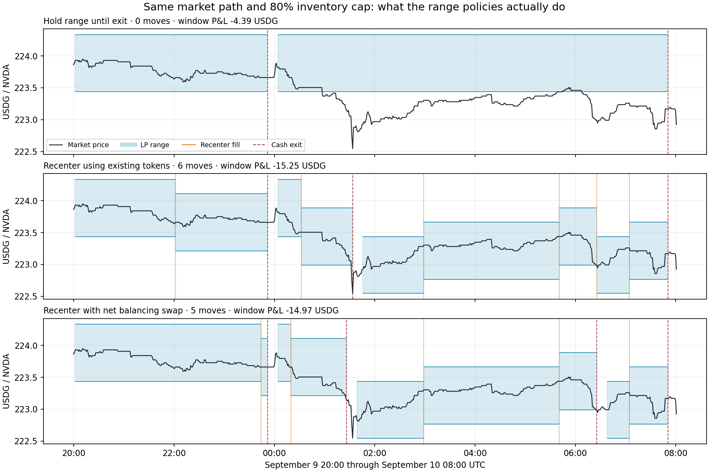

# Off-hours LP recentering × inventory caps — September 11, 2026

**Recentring is now explicitly modeled, separately from inventory liquidation. This particular rule improves range coverage but reduces net returns under every cost profile tested.** It should remain a research candidate until new data and an economic action rule support deployment. The paper strategy is unchanged.

The subsequent [fee and cost validity audit](../lp-cost-validity-2026-09-11/README.md) found the recenter probes used roughly 0.8-gwei gas versus about 0.2 gwei for the median saved campaign operation. At a common 0.20 gwei, the 80% hold/net-swap means are −1.512033/−2.740670 USDG per window. The tested recenter trigger still underperforms on average, but its estimated loss is much smaller than the high-snapshot scenario below.

## What is compared

Nine policies cross **60/70/80% inventory exit thresholds** with three range policies. They start each allowed window with **939.964887 USDG**, use an **80% allocation setting** and a **±20 raw-tick range**, and retain the same guards, reentry, source timing and off-hours schedule as the [cap baseline](../lp-offhours-cap-2026-09-11/README.md).

| Range policy | Range movement | Inventory trade |
|---|---|---|
| Hold range | Only a new entry after a full cash exit chooses a fresh center | Exit liquidates NVDA; subsequent entry buys again |
| Preserve tokens | Withdraw/collect and mint the new range using existing balances | None; surplus tokens remain idle and count toward exposure |
| Net swap | Withdraw/collect, calculate the new range's funding ratio, and mint there | A single net buy or sell to fund the new position; it does not first liquidate all NVDA |

The last policy solves for the net trade needed to fund the configured deployment target. It does not claim to find the smallest trade for every possible lower-liquidity allocation. The 80% setting reserves roughly 20% of gross token inventory as USDG; gas is accounted separately. Actual LP principal as a fraction of net NAV is measured, rather than assumed to equal 80%. A no-swap move can deploy substantially less when the token mix does not match the new range.

**Range trigger:** market tick is at least **10 raw ticks from the current center**, in the same direction across **two distinct checkpoint observations spanning at least 60 seconds**. Allow a move only after **600 seconds since entry or the last successful move**. A return below the displacement threshold or a reversal resets confirmation. These are explicit test settings, not fitted or optimal parameters.

A signal freezes a quote. A fill requires a **later source block**, quote age ≤90 seconds, tick drift ≤5 ticks, the original swap and mint minimum amounts, initialized boundaries, the existing liquidity-share limit, a valid ±5% reference-price band, and post-move exposure below the candidate's inventory cap. A rejected fill preserves the old portfolio and accrued fees in the atomic replay model. Range moves repeat when the rule triggers; they do not restart the 24-hour session clock or reset the passive benchmark.

**Inventory and safety exits take priority.** A hard cap can therefore force cash liquidation before a proposed range move completes. Moving the range without a swap does not reduce the total NVDA already owned. Both quotes and fills for new deployments stop 30 minutes before excluded hours; scheduled cash exits are still requested 10 minutes before the boundary.

## Historical results

The study reuses exactly the previous canonical capture: **5,839 checkpoints, 717,465 events and 49,880 health samples**, ending September 11 07:18:05 UTC. Three complete allowed windows qualify. The initial weekend is partial and has missed holding decisions; the final overnight is incomplete at capture. Neither is ranked. These are correlated overnight windows of different lengths, with no complete weekend validation yet.

**Mean net cash P&L per complete window, USDG**, using the original saved entry/exit profile plus recorded recenter action costs:

| Range policy | 60% cap | 70% cap | 80% cap |
|---|---:|---:|---:|
| Hold range | −3.934062 | −3.030010 | −2.025651 |
| Preserve tokens | −8.009620 | −8.145037 | −9.044826 |
| Net swap | −8.329902 | −8.814810 | −9.052077 |

Neither recenter policy improves any of the three complete windows under this profile. At 60% and 70%, neither policy moves in the short first window, so it ties its corresponding baseline there. This demonstrates the interaction between the cap and recenter eligibility.

| Cap | Preserve: moves / swaps | Net swap: moves / swaps |
|---|---:|---:|
| 60% | 6 / 0 | 5 / 5 |
| 70% | 9 / 0 | 7 / 7 |
| 80% | 12 / 0 | 11 / 11 |

At the **80% cap**, across all three complete windows:

| Metric | Hold range | Preserve tokens | Net swap |
|---|---:|---:|---:|
| Time outside range | 9.083 hours | 5.083 minutes | 5.100 minutes |
| Average LP principal / net NAV during holding | 75.28% | 51.93% | 77.06% |
| Modeled fees | 6.610951 | 7.640101 | 10.899553 |
| All entry, move and exit gas estimates | 4.203872 | 24.989460 | 28.258386 |
| Full entry/exit cycles | 4 | 6 | 6 |

Monetary totals are USDG. Net-swap recentering earns **4.288602** more in fees but incurs **24.054514** more estimated gas than holding the range. Price exposure, swaps and changed exit timing also affect P&L. The reduction in time outside the range is therefore insufficient to establish economic benefit.

The no-swap policy's increased range coverage also comes with less deployed capital. A narrow active range funded by a small subset of the portfolio is different from keeping the whole intended deployment active. Idle NVDA remains part of the inventory limit.



This chart shows the September 9–10 overnight with the 80% cap and original cost profile. Blue bands are the actual modeled LP ranges, orange lines are recenter fills, and dashed red lines are full cash exits. Gaps between bands are cash periods. The chart is an illustration of recorded actions in this replay, not a separate performance sample.

## Costs and the control against unequal snapshots

The original baseline uses entry **0.868343**, exit **0.182625**, and passive buy **0.251146 USDG** from saved paper fork evidence. Recenter components are:

| Component | USDG estimate | Evidence |
|---|---:|---|
| Withdraw and collect | 0.491842 | Larger observed withdrawal estimate across the probes |
| Approvals and mint | 1.065129 | Larger observed mint group across the probes |
| Buy including approval | 0.408392 | Newly executed owned fork at session 54, observation 3016 |
| Sell including approval | 0.475109 | Existing owned recenter fork for session 54 |

Thus a no-swap move is charged **1.556971**, a buy-funded move **1.965363**, and a sell-funded move **2.032080 USDG** in the base scenario. The new buy probe executed six local transactions, reconciled balances and mint amounts against exact replay math, and estimated **1.838572 USDG** for its actual bundle. The scenario uses the larger observed withdrawal/mint groups, rather than substituting that smaller total. [Cost evidence](cost-evidence.json) records source blocks, hashes, observations, transaction groups and raw proof hashes. These are historical local Nitro fork estimates, not mainnet receipts or future gas quotes.

**Different source blocks can distort a cost comparison.** The additional `common_components` control charges initial entry as the same **buy + mint = 1.473521 USDG** components used for recentering and uses a **1.124903 USDG** full exit actually estimated at the sell-recenter source block. That entry bundle is a composed cost scenario, not a separately executed entry proof. This removes the large discrepancy between the cheaper original full exits and the older recenter estimates without claiming identical transaction prestates.

| Range policy | 60% cap | 70% cap | 80% cap |
|---|---:|---:|---:|
| Hold range, common components | −10.121893 | −7.670176 | −4.087728 |
| Preserve, common components | −14.194140 | −12.784273 | −12.090840 |
| Net swap, common components | −15.028176 | −13.966781 | −12.147374 |

The conclusion holds in this control. A third profile doubles the original gas estimates and halves modeled fees; recentering also underperforms there. The complete results retain all **nine policies × three cost profiles**, with per-window actions and exclusions. Nothing is selected or promoted automatically.

## Rejections and practical limits

At the 80% cap under the original profile, there were **21 rejected preserve fills and 34 rejected net-swap fills** because the later mint could not satisfy its frozen minimum amounts. Guards and the session cutoff also canceled intents. A small price move can substantially alter the required token ratio inside a narrow range, even if overall price slippage looks small. The model retains these rejections rather than relaxing the minimums after seeing the fill.

All entry, removal, optional swap, mint and final exit costs are charged for successful modeled actions. **The recenter model is atomic, while the fork proof uses sequential transactions.** It does not charge gas or model residual exposure from a partial bundle failure. That omission is optimistic for recentering; successful full-bundle probes are not proof of reliable live execution. Native gas is valued as an economic cost and is not a simulated USDG transfer.

Fee accrual follows canonical crossings with added-liquidity dilution and retained integer remainders. Hypothetical actions do not change the later recorded market path. Time outside the range and deployed-capital averages use checkpoint intervals. Current-risk refresh timing is approximated by source-reference eligibility; historical ETH/USD gas-feed freshness is not proven. Missing holding decisions and incomplete boundary coverage remain unavailable evidence. Every matched policy uses the same starting inventory benchmark per window; capital compounds within a window but resets between windows.

There is **no forecast-based economic gate** in this diagnostic. Its purpose is to establish what this persistent displacement trigger does after costs. Before deploying active recentering, the next research change should test an economic condition for moving, or a less frequent trigger, with fresh comparable cost quotes and new data. These results do not imply that all recentering policies lose money.

## Prospective validation and paper status

The [frozen plan](frozen-plan.json), code hashes and three cost profiles are pinned before the next allowed period begins on September 11 at 20:00 UTC. Plan SHA-256: `b8baf07cf181fc750528801c4c2c69abf3cdbc66a0ef302190feee6e66705e47`.

`conc-liq-recenter-validation.timer` is **enabled and active for Monday, September 14 at 08:35 UTC / 11:35 Vilnius**. Its service requires and runs after `conc-liq-cap-validation.service`, so the nine-policy comparison reuses the same verified weekend capture after that job completes. It does not require another database capture or revive the former four-strategy experiment. It evaluates Friday after-hours through the Monday 08:00 UTC cash boundary, including 30 minutes afterward for late exit accounting.

The immutable-by-hash capsule contains the source and uses sealed runtime dependencies. The runner rejects an altered plan or code, an early run, bad capture hashes and missing prospective boundaries. Results will be `/root/conc-liq/data/lp-recenter-validation-2026-09-14/replay.json`, with `completed.json` or `failure.json`; dependency failures are also visible in the systemd journal. This remains a replay on newly accumulated data, not simultaneous live transactions.

**Paper behavior was not changed.** Session 56 successfully exited for `paper_scheduled_cash_exit` through run 194 at **07:52:25 UTC**, before the 08:00 deadline. It finished with **939.153429 USDG**, preserving its **−0.811458 USDG** loss. Session 57 is waiting in cash for the next allowed hours, with valid campaign ancestry and the existing 60% inventory cap. The automatic paper timer and dashboard remain active.

## Evidence and reproduction

- [Full results and actions](results.json), [window CSV](windows.csv), [range chart source](chart-data.json), [verification audit](audit.json).
- Raw fork proof and working outputs: `/root/conc-liq/data/lp-recenter-study-2026-09-11/`. Original market capture and its SHA-256 remain under the cap study directory.
- `src/research/offhours-recenter.ts` adds research range management over the unchanged cap model. It does not add production paper recentering or any broadcast capability.
- All baseline fields and actions matched the previous comparison across every original window and cost profile. Independent checks reconcile every gas charge, P&L, alpha, move count, frozen-source timing and post-fill cap, and verify zero swaps for the preserve policy.
- Typecheck and **16 focused tests passed**, including previously executed sell/no-swap fork fixtures, the new buy fork fixture, delayed failure conservation, persistence/cooldown, cap priority, reentry cost accounting and exact baseline equivalence. Capsule imports, systemd validation, hash checks and the early-run rejection passed.

```sh
.tools/node/bin/node --import tsx scripts/replay-offhours-recenter.mjs \
  data/lp-cap-study-2026-09-11/market.json \
  notes/lp-recenter-study-2026-09-11/frozen-plan.json \
  /tmp/offhours-recenter-reproduction.json
python3 scripts/verify-offhours-recenter.py
.tools/inventory-report-venv/bin/python scripts/render-offhours-recenter.py
systemctl status conc-liq-recenter-validation.timer
journalctl -u conc-liq-recenter-validation.service --no-pager
```
