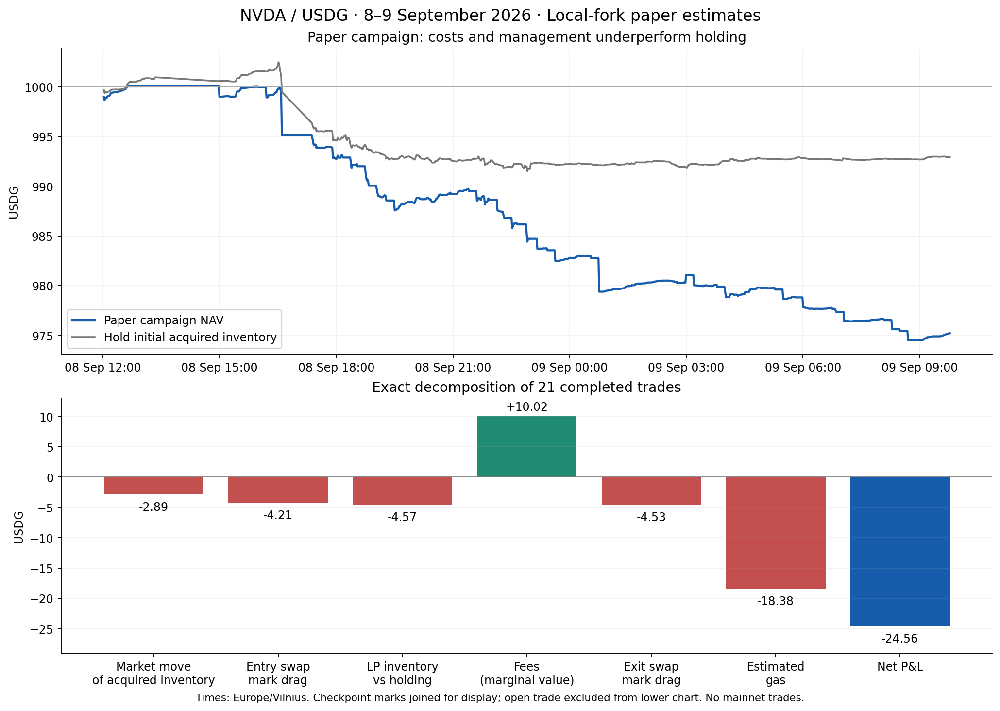

# Paper-session performance audit — 9 September 2026

Frozen database cutoff: **09 Sep 09:47:20 Europe/Vilnius** (2026-09-09T06:47:20.500Z). The last portfolio source is 09 Sep 09:46:36. This audit covers every session created since midnight September 8 local time: **5–26**. Sessions 1–4 predate this campaign; 1–3 never entered and session 4 was a separate earlier trial, so their budgets and P&L are not added to this funded chain.

All observations, execution runs, policy hashes, runtime identities, source hashes and carried cash were checked in one read-only repeatable-read database snapshot. No runtime policy or service was changed for this analysis.

## Result

21 completed trades turned **1,000.000000 into 975.438231 USDG**: **−24.561769 USDG (−2.4562%)**. Two made an absolute profit; only session 12 beat its own acquired-inventory holding comparator. Including open session 26, marked NAV is **975.202371 USDG**, P&L **-24.797629**, versus **992.926932** for holding the original campaign inventory: **-17.724561 USDG alpha**.

Closed trades earned **10.018826 USDG** in reported fee value, paid **18.381092 USDG** in estimated gas and lost **8.737653 USDG** to entry/exit execution relative to source pool-price marks. Only sessions 7 and 12 earned fees exceeding gas; session 7 still lost heavily to price and inventory effects. Median holding time was **23.68 minutes**.

## Every session

All monetary figures below are USDG. Entry/exit clocks are source-block times in Europe/Vilnius, not database write times. Alpha is per-session against its acquired inventory; these alphas **must not be summed as campaign alpha**.

| Session | Entry local | Exit/last local | Hold min | P&L | Fees | Gas paid | Session alpha | First exit trigger |
|---|---|---|---:|---:|---:|---:|---:|---|
| 5 | 08 Sep 12:01:35 | 08 Sep 13:21:26 | 79.8 | 0.0440 | 0.7953 | 0.8693 | -0.9005 | Chain readiness |
| 6 | 08 Sep 14:59:46 | 08 Sep 16:00:09 | 60.4 | -0.0766 | 0.4893 | 0.8352 | -0.8739 | Chain readiness |
| 7 | 08 Sep 16:12:25 | 08 Sep 16:36:06 | 23.7 | -4.8308 | 1.1321 | 0.8170 | -1.8602 | Inventory ≥60% |
| 8 | 08 Sep 17:25:17 | 08 Sep 18:10:16 | 45.0 | -2.2645 | 0.0557 | 0.8544 | -0.9901 | Risk refresh unavailable |
| 9 | 08 Sep 18:23:32 | 08 Sep 18:32:47 | 9.2 | -0.8756 | 0.1042 | 0.8155 | -0.7685 | USDG oracle stale |
| 10 | 08 Sep 18:46:05 | 08 Sep 18:50:12 | 4.1 | -1.9615 | 0.1056 | 0.8224 | -1.0150 | Inventory ≥60% |
| 11 | 08 Sep 19:04:32 | 08 Sep 19:17:54 | 13.4 | -1.4832 | 0.6247 | 0.8356 | -0.6423 | Inventory ≥60% |
| 12 | 08 Sep 19:30:11 | 08 Sep 21:24:46 | 114.6 | 0.9596 | 2.2519 | 0.8212 | 1.3631 | Chain readiness |
| 13 | 08 Sep 21:37:02 | 08 Sep 21:56:29 | 19.4 | -0.8931 | 0.8143 | 0.8234 | -0.2379 | Inventory ≥60% |
| 14 | 08 Sep 22:08:45 | 08 Sep 22:19:02 | 10.3 | -1.7989 | 0.1582 | 0.8148 | -0.9537 | Chain readiness |
| 15 | 08 Sep 22:31:20 | 08 Sep 22:39:32 | 8.2 | -0.6746 | 0.1149 | 0.8328 | -0.7989 | Chain readiness |
| 16 | 08 Sep 22:53:55 | 08 Sep 22:55:59 | 2.1 | -1.4458 | 0.1966 | 0.8148 | -0.7985 | Inventory ≥60% |
| 17 | 08 Sep 23:10:19 | 08 Sep 23:25:42 | 15.4 | -1.1560 | 0.1707 | 0.8240 | -0.7337 | Chain readiness |
| 18 | 08 Sep 23:38:00 | 09 Sep 00:33:16 | 55.3 | -0.8075 | 0.4262 | 0.8241 | -0.4902 | Risk refresh unavailable |
| 19 | 09 Sep 00:45:36 | 09 Sep 02:59:37 | 134.0 | -1.6958 | 1.1201 | 2.1938 | -0.7890 | Chain readiness |
| 20 | 09 Sep 03:11:52 | 09 Sep 03:47:49 | 36.0 | -1.1977 | 0.1468 | 0.7995 | -0.7595 | Risk refresh unavailable |
| 21 | 09 Sep 04:01:08 | 09 Sep 05:17:05 | 76.0 | -0.2470 | 0.6879 | 0.7801 | -0.1705 | Risk refresh unavailable |
| 22 | 09 Sep 05:29:27 | 09 Sep 05:47:55 | 18.5 | -0.7914 | 0.1582 | 0.7588 | -0.6300 | Risk refresh unavailable |
| 23 | 09 Sep 06:00:12 | 09 Sep 06:51:22 | 51.2 | -1.4676 | 0.1791 | 0.7595 | -0.7904 | Inventory ≥60% |
| 24 | 09 Sep 07:03:38 | 09 Sep 08:05:11 | 61.5 | -0.8140 | 0.2621 | 0.7453 | -0.5145 | Risk refresh unavailable |
| 25 | 09 Sep 08:17:28 | 09 Sep 08:29:49 | 12.3 | -1.0838 | 0.0248 | 0.7398 | -0.7624 | Chain readiness |
| 26 | 09 Sep 08:42:06 | 09 Sep 09:46:36 | 64.5 | -0.2359 | 0.5006 | 0.4389 | -0.1560 | Open |

## Why positions closed

| Primary group | Sessions | Count | P&L | Gas | Fees |
|---|---|---:|---:|---:|---:|
| Inventory threshold | 7, 10, 11, 13, 16, 23 | 6 | -12.081867 | 4.872691 | 3.052556 |
| Chain readiness (includes mixed #14) | 5, 6, 12, 14, 15, 17, 19, 25 | 8 | -5.482167 | 7.930734 | 5.125240 |
| Risk/reference only | 8, 9, 18, 20, 21, 22, 24 | 7 | -6.997735 | 5.577667 | 1.841030 |

**15 of 21 exits (71%) were triggered by infrastructure or reference availability, rather than the inventory limit.** These are associated losses, not a counterfactual estimate of avoidable losses. Ordinary fees, acquisition costs and market exposure would still exist under another policy.

### Risk refresh race

Sessions **8, 14, 18, 20, 21, 22 and 24** recorded `paper_current_risk_evidence_unavailable` while the latest risk refresh was in flight. Its completion timestamp followed the recorded decision timestamp by 4, 120, 112, 33, 1,767, 115 and 106 ms respectively. Prior completed snapshot observation ages were only 4.8–23.5 seconds. Six had no other first-exit reason; session 14 also had a genuine chain-recovery gate.

The code selects the **latest attempt**, including `started`, rather than the latest completed valid snapshot. It then makes an open position request an exit when that attempt is unfinished. This explains the observed race. Historical `validated_at` rows are mutable, so the exact prior canonical-validation age is not recoverable from the current row alone; a future fix must still verify canonicality and all existing age limits before using the last completed snapshot. Do not treat a failed or stale refresh as healthy.

### Chain readiness

Private-node events: #5 and #14 had `private_reports_syncing`; #6, #12, #15 and #19 had 42, 22, 27 and 30 blocks of lag respectively (about 2–4 seconds). All exceed the requested ten-block tolerance except the syncing events, which are a separate gate. Recovery plus later-checkpoint scheduling commonly delayed exits by roughly five to seven minutes.

Sessions **17 and 25** expose a separate reference-side mismatch: private lag was only 3 and 1 blocks, with monitor status healthy. Reference-head spread was 84 and 67 blocks. The anchor selector reused the slow reference head, giving that reference **zero** confirmations beyond the anchor, while LP readiness requires **64 on each participating node**. The private ten-block adjustment does not solve this.

### Entry quality and cost

Nine overlap-deferred simulations (seven entries and two exits) preserved capital and avoided invalidation. One additional entry failed on current risk evidence. These rejected local simulations charged no strategy gas. However, delaying the fill while retaining a narrow frozen range can materially alter deployment: #8 deployed 39.21% and #9 52.43% of initial capital despite the 80% target. Quote-to-entry movement was 18 and 11 ticks. A deployment target is not a guaranteed fill.

Session #19 paid 1.874838 USDG entry gas during a 0.915438-gwei base-fee spike; its later exit cost only 0.318946 USDG. There is no demonstrated fee-payback admission rule that rejected that expensive entry. Its full trade lost 1.695832 USDG despite over two hours invested.

## Exact completed-trade attribution

| Component | Contribution, USDG |
|---|---:|
| Price movement of each session’s acquired holding inventory | -2.893508 |
| Entry execution drag versus source spot | -4.205629 |
| LP principal/idle inventory versus that holding inventory | -4.568356 |
| Marginal fee value at exit spot | 10.018840 |
| Exit execution drag versus source spot | -4.532024 |
| Estimated gas | -18.381092 |
| **Net P&L** | **-24.561769** |

These terms reconcile to the micro-USDG for every session. The LP-inventory term includes mint funding/mark effects and price-driven inventory divergence; it is not an isolated causal estimate of adverse selection. Marginal fee value differs from separately rounded reported fees by 0.000014 USDG in aggregate. All costs are fork estimates and simulated swap proceeds.

## Individual session reviews

### Session 5: Chain readiness

Small positive absolute P&L, but holding earned more. A private syncing signal at 13:14:03 Vilnius reset recovery; the exit followed about five minutes after its signal. Considerable time was already outside the range, limiting fees. This precedes the small-lag fix.

- **Funding and result:** 1,000.000000 → 1,000.043983 USDG; P&L 0.043983; session alpha -0.900527. Parent: campaign root.
- **Range and deployment:** ticks 221880–221920 (±20 raw ticks); entry/last ticks 221896/221858; actual entry LP 79.63% of capital. NVDA exposure at entry 33.40%; maximum observed 52.69%.
- **Timing:** created 08 Sep 12:00:26; entry 08 Sep 12:01:35; signal 08 Sep 13:16:18; exit/last 08 Sep 13:21:26. Entry wait 1.15 min (includes cooldown where applicable), quote-to-entry 37.15 sec; signal-to-exit 308 sec.
- **Economics:** fees 0.795260; entry gas 0.520941; exit gas 0.348333; remaining exit reserve 0.000000. Recorded maximum drawdown 0.1351%.
- **Price and path:** pool NVDA price 231.012843 → 231.888580 USDG (+0.3791%); 6733 observed swaps, tick extrema 221858–221907. Checkpoint-weighted in-range/outside time 36.8/43.0 min; intraminute crossings are not captured by that occupancy approximation.
- **Verification:** 76 fee intervals reproduced from saved boundary readings and canonical Mint/Burn events; cash, costs and P&L decomposition reconcile. Failed prospective attempts: 0. Saved-exit recovery: no.
- **Exact first-exit reasons:** `chain_recovery_not_continuously_healthy`, `chain_recovery_unproven`.

  Health evidence 32176, 08 Sep 13:14:03: state open, lag 0 blocks / 0 sec; private_reports_syncing.

### Session 6: Chain readiness

A 42-block / four-second private delay caused degradation and a confirmation-depth failure. Fees did not cover gas. The earlier ten-block anchor adjustment deliberately does not exempt a 42-block delay.

- **Funding and result:** 1,000.043983 → 999.967410 USDG; P&L -0.076573; session alpha -0.873909. Parent: 5.
- **Range and deployment:** ticks 221850–221890 (±20 raw ticks); entry/last ticks 221868/221840; actual entry LP 73.24% of capital. NVDA exposure at entry 40.90%; maximum observed 46.13%.
- **Timing:** created 08 Sep 14:57:47; entry 08 Sep 14:59:46; signal 08 Sep 15:55:02; exit/last 08 Sep 16:00:09. Entry wait 1.98 min (includes cooldown where applicable), quote-to-entry 38.15 sec; signal-to-exit 307 sec.
- **Economics:** fees 0.489336; entry gas 0.501934; exit gas 0.333295; remaining exit reserve 0.000000. Recorded maximum drawdown 0.1059%.
- **Price and path:** pool NVDA price 231.658527 → 232.308861 USDG (+0.2807%); 5644 observed swaps, tick extrema 221840–221871. Checkpoint-weighted in-range/outside time 46.0/14.4 min; intraminute crossings are not captured by that occupancy approximation.
- **Verification:** 57 fee intervals reproduced from saved boundary readings and canonical Mint/Burn events; cash, costs and P&L decomposition reconcile. Failed prospective attempts: 0. Saved-exit recovery: no.
- **Exact first-exit reasons:** `chain_recovery_not_continuously_healthy`, `chain_anchor_quorum_unproven`, `chain_recovery_unproven`.

  Health evidence 33128, 08 Sep 15:53:04: state degraded, lag 42 blocks / 4 sec; private_block_lag_soft, private:depth_31.

### Session 7: Inventory ≥60%

Worst trade. NVDA exposure reached 69.81% at the signal and the market then moved beyond the upper tick boundary before the next-checkpoint exit. Price movement and LP inventory divergence both hurt. Its timely saved exit was recovered after the overlap-coverage race; the loss and full original failed execution row remain in evidence.

- **Funding and result:** 999.967410 → 995.136631 USDG; P&L -4.830779; session alpha -1.860213. Parent: 6.
- **Range and deployment:** ticks 221820–221860 (±20 raw ticks); entry/last ticks 221841/221903; actual entry LP 79.31% of capital. NVDA exposure at entry 42.74%; maximum observed 69.81%.
- **Timing:** created 08 Sep 16:00:45; entry 08 Sep 16:12:25; signal 08 Sep 16:35:04; exit/last 08 Sep 16:36:06. Entry wait 11.66 min (includes cooldown where applicable), quote-to-entry 23.48 sec; signal-to-exit 62 sec.
- **Economics:** fees 1.132089; entry gas 0.489179; exit gas 0.327805; remaining exit reserve 0.000000. Recorded maximum drawdown 0.4830%.
- **Price and path:** pool NVDA price 232.287789 → 230.861861 USDG (-0.6139%); 2450 observed swaps, tick extrema 221807–221904. Checkpoint-weighted in-range/outside time 21.6/2.1 min; intraminute crossings are not captured by that occupancy approximation.
- **Verification:** 23 fee intervals reproduced from saved boundary readings and canonical Mint/Burn events; cash, costs and P&L decomposition reconcile. Failed prospective attempts: 0. Saved-exit recovery: yes, full original failure retained.
- **Exact first-exit reasons:** `paper_inventory_threshold_exit_to_cash`.

### Session 8: Risk refresh unavailable

Two entry simulations were deferred by overlap coverage. During the 164-second quote-to-entry interval the tick moved 18 ticks; only 39.21% of capital became LP, against an 80% target. It spent most observed time outside the range and earned only 0.055680 USDG. The eventual exit coincided with an in-flight risk refresh.

- **Funding and result:** 995.136631 → 992.872139 USDG; P&L -2.264492; session alpha -0.990053. Parent: 7.
- **Range and deployment:** ticks 221980–222020 (±20 raw ticks); entry/last ticks 222014/222043; actual entry LP 39.21% of capital. NVDA exposure at entry 33.88%; maximum observed 39.25%.
- **Timing:** created 08 Sep 17:21:27; entry 08 Sep 17:25:17; signal 08 Sep 18:09:16; exit/last 08 Sep 18:10:16. Entry wait 3.82 min (includes cooldown where applicable), quote-to-entry 164.25 sec; signal-to-exit 60 sec.
- **Economics:** fees 0.055680; entry gas 0.516032; exit gas 0.338348; remaining exit reserve 0.000000. Recorded maximum drawdown 0.2402%.
- **Price and path:** pool NVDA price 228.304015 → 227.651191 USDG (-0.2859%); 2369 observed swaps, tick extrema 222012–222052. Checkpoint-weighted in-range/outside time 6.2/38.8 min; intraminute crossings are not captured by that occupancy approximation.
- **Verification:** 44 fee intervals reproduced from saved boundary readings and canonical Mint/Burn events; cash, costs and P&L decomposition reconcile. Failed prospective attempts: 2. Saved-exit recovery: no.
- **Exact first-exit reasons:** `paper_current_risk_evidence_unavailable`.

### Session 9: USDG oracle stale

One deferred entry and an 11-tick quote-to-entry move left only 52.43% deployed. It exited after nine minutes because the independent USDG oracle was stale. This is a published-price freshness gate, distinct from the risk-refresh race.

- **Funding and result:** 992.872139 → 991.996569 USDG; P&L -0.875570; session alpha -0.768525. Parent: 8.
- **Range and deployment:** ticks 222040–222080 (±20 raw ticks); entry/last ticks 222072/222067; actual entry LP 52.43% of capital. NVDA exposure at entry 43.17%; maximum observed 43.17%.
- **Timing:** created 08 Sep 18:11:00; entry 08 Sep 18:23:32; signal 08 Sep 18:31:45; exit/last 08 Sep 18:32:47. Entry wait 12.53 min (includes cooldown where applicable), quote-to-entry 109.22 sec; signal-to-exit 62 sec.
- **Economics:** fees 0.104200; entry gas 0.483878; exit gas 0.331632; remaining exit reserve 0.000000. Recorded maximum drawdown 0.1048%.
- **Price and path:** pool NVDA price 226.975559 → 227.108079 USDG (+0.0584%); 613 observed swaps, tick extrema 222062–222072. Checkpoint-weighted in-range/outside time 9.2/0.0 min; intraminute crossings are not captured by that occupancy approximation.
- **Verification:** 9 fee intervals reproduced from saved boundary readings and canonical Mint/Burn events; cash, costs and P&L decomposition reconcile. Failed prospective attempts: 1. Saved-exit recovery: no.
- **Exact first-exit reasons:** `paper_usdg_oracle_price_stale`.

### Session 10: Inventory ≥60%

One deferred entry; 65.23% initial deployment and 47.61% starting NVDA exposure. Inventory exceeded 60% after only a few minutes. Another round trip cost more than seven times the fees earned.

- **Funding and result:** 991.996569 → 990.035106 USDG; P&L -1.961463; session alpha -1.015045. Parent: 9.
- **Range and deployment:** ticks 222040–222080 (±20 raw ticks); entry/last ticks 222069/222081; actual entry LP 65.23% of capital. NVDA exposure at entry 47.61%; maximum observed 63.04%.
- **Timing:** created 08 Sep 18:33:21; entry 08 Sep 18:46:05; signal 08 Sep 18:49:10; exit/last 08 Sep 18:50:12. Entry wait 12.73 min (includes cooldown where applicable), quote-to-entry 97.13 sec; signal-to-exit 62 sec.
- **Economics:** fees 0.105648; entry gas 0.494403; exit gas 0.328025; remaining exit reserve 0.000000. Recorded maximum drawdown 0.1977%.
- **Price and path:** pool NVDA price 227.060152 → 226.787302 USDG (-0.1202%); 97 observed swaps, tick extrema 222069–222081. Checkpoint-weighted in-range/outside time 4.1/0.0 min; intraminute crossings are not captured by that occupancy approximation.
- **Verification:** 4 fee intervals reproduced from saved boundary readings and canonical Mint/Burn events; cash, costs and P&L decomposition reconcile. Failed prospective attempts: 1. Saved-exit recovery: no.
- **Exact first-exit reasons:** `paper_inventory_threshold_exit_to_cash`.

### Session 11: Inventory ≥60%

Two deferred entries delayed deployment. Exposure later jumped from a 32.97% entry reading to 70.39% at the exit signal; the next-checkpoint close retained the loss. Fees covered much of gas, but not swap costs and inventory effects.

- **Funding and result:** 990.035106 → 988.551911 USDG; P&L -1.483195; session alpha -0.642315. Parent: 10.
- **Range and deployment:** ticks 222070–222110 (±20 raw ticks); entry/last ticks 222086/222103; actual entry LP 77.45% of capital. NVDA exposure at entry 32.97%; maximum observed 70.39%.
- **Timing:** created 08 Sep 18:50:49; entry 08 Sep 19:04:32; signal 08 Sep 19:16:53; exit/last 08 Sep 19:17:54. Entry wait 13.71 min (includes cooldown where applicable), quote-to-entry 157.14 sec; signal-to-exit 61 sec.
- **Economics:** fees 0.624730; entry gas 0.502618; exit gas 0.333020; remaining exit reserve 0.000000. Recorded maximum drawdown 0.1498%.
- **Price and path:** pool NVDA price 226.655917 → 226.285816 USDG (-0.1633%); 4799 observed swaps, tick extrema 222086–222106. Checkpoint-weighted in-range/outside time 13.4/0.0 min; intraminute crossings are not captured by that occupancy approximation.
- **Verification:** 13 fee intervals reproduced from saved boundary readings and canonical Mint/Burn events; cash, costs and P&L decomposition reconcile. Failed prospective attempts: 2. Saved-exit recovery: no.
- **Exact first-exit reasons:** `paper_inventory_threshold_exit_to_cash`.

### Session 12: Chain readiness

Best trade and the only completed trade with positive session alpha. It stayed in range for roughly 115 minutes, earned 2.251946 USDG in fees and paid 0.821152 USDG in gas. A 22-block / two-second node delay ended it. It shows fee capture can work when the position survives long enough, but one case is not a calibrated optimum.

- **Funding and result:** 988.551911 → 989.511551 USDG; P&L 0.959640; session alpha 1.363130. Parent: 11.
- **Range and deployment:** ticks 222090–222130 (±20 raw ticks); entry/last ticks 222107/222110; actual entry LP 79.33% of capital. NVDA exposure at entry 35.76%; maximum observed 58.14%.
- **Timing:** created 08 Sep 19:18:35; entry 08 Sep 19:30:11; signal 08 Sep 21:19:41; exit/last 08 Sep 21:24:46. Entry wait 11.59 min (includes cooldown where applicable), quote-to-entry 46.49 sec; signal-to-exit 305 sec.
- **Economics:** fees 2.251946; entry gas 0.483707; exit gas 0.337445; remaining exit reserve 0.000000. Recorded maximum drawdown 0.1010%.
- **Price and path:** pool NVDA price 226.187009 → 226.131875 USDG (-0.0244%); 12772 observed swaps, tick extrema 222096–222119. Checkpoint-weighted in-range/outside time 114.6/0.0 min; intraminute crossings are not captured by that occupancy approximation.
- **Verification:** 110 fee intervals reproduced from saved boundary readings and canonical Mint/Burn events; cash, costs and P&L decomposition reconcile. Failed prospective attempts: 0. Saved-exit recovery: no.
- **Exact first-exit reasons:** `chain_recovery_not_continuously_healthy`, `chain_anchor_quorum_unproven`, `chain_recovery_unproven`.

  Health evidence 35069, 08 Sep 21:17:14: state degraded, lag 22 blocks / 2 sec; private_block_lag_soft, private:depth_51.

### Session 13: Inventory ≥60%

The inventory signal occurred at 72.00% exposure. A subsequent health-recovery wait and an overlap-deferred exit extended signal-to-exit to 428 seconds. Price recovered during that delay; it is not valid to call the whole loss avoidable gas or the delay necessarily harmful.

- **Funding and result:** 989.511551 → 988.618471 USDG; P&L -0.893080; session alpha -0.237895. Parent: 12.
- **Range and deployment:** ticks 222090–222130 (±20 raw ticks); entry/last ticks 222106/222116; actual entry LP 78.36% of capital. NVDA exposure at entry 34.15%; maximum observed 72.00%.
- **Timing:** created 08 Sep 21:25:17; entry 08 Sep 21:37:02; signal 08 Sep 21:49:21; exit/last 08 Sep 21:56:29. Entry wait 11.74 min (includes cooldown where applicable), quote-to-entry 41.95 sec; signal-to-exit 428 sec.
- **Economics:** fees 0.814347; entry gas 0.491220; exit gas 0.332189; remaining exit reserve 0.000000. Recorded maximum drawdown 0.1391%.
- **Price and path:** pool NVDA price 226.211831 → 225.981100 USDG (-0.1020%); 3769 observed swaps, tick extrema 222098–222125. Checkpoint-weighted in-range/outside time 19.4/0.0 min; intraminute crossings are not captured by that occupancy approximation.
- **Verification:** 18 fee intervals reproduced from saved boundary readings and canonical Mint/Burn events; cash, costs and P&L decomposition reconcile. Failed prospective attempts: 1. Saved-exit recovery: no.
- **Exact first-exit reasons:** `paper_inventory_threshold_exit_to_cash`.

### Session 14: Chain readiness

Two overlapping conditions: a private syncing signal in the recovery window and an unfinished risk refresh. Treat this as a mixed infrastructure exit; removing only the refresh race would not by itself eliminate the chain gate.

- **Funding and result:** 988.618471 → 986.819587 USDG; P&L -1.798884; session alpha -0.953730. Parent: 13.
- **Range and deployment:** ticks 222100–222140 (±20 raw ticks); entry/last ticks 222123/222133; actual entry LP 79.85% of capital. NVDA exposure at entry 47.28%; maximum observed 69.17%.
- **Timing:** created 08 Sep 21:57:17; entry 08 Sep 22:08:45; signal 08 Sep 22:11:51; exit/last 08 Sep 22:19:02. Entry wait 11.46 min (includes cooldown where applicable), quote-to-entry 40.16 sec; signal-to-exit 431 sec.
- **Economics:** fees 0.158236; entry gas 0.483681; exit gas 0.331076; remaining exit reserve 0.000000. Recorded maximum drawdown 0.1819%.
- **Price and path:** pool NVDA price 225.827744 → 225.599606 USDG (-0.1010%); 577 observed swaps, tick extrema 222123–222134. Checkpoint-weighted in-range/outside time 10.3/0.0 min; intraminute crossings are not captured by that occupancy approximation.
- **Verification:** 6 fee intervals reproduced from saved boundary readings and canonical Mint/Burn events; cash, costs and P&L decomposition reconcile. Failed prospective attempts: 0. Saved-exit recovery: no.
- **Exact first-exit reasons:** `chain_recovery_not_continuously_healthy`, `paper_current_risk_evidence_unavailable`, `chain_recovery_unproven`.

  Health evidence 35384, 08 Sep 22:09:51: state open, lag 0 blocks / 0 sec; private_reports_syncing.

### Session 15: Chain readiness

A 27-block / three-second private delay reset readiness. The position earned only 0.114867 USDG before closing. No inventory or true-price exit was recorded.

- **Funding and result:** 986.819587 → 986.144946 USDG; P&L -0.674641; session alpha -0.798882. Parent: 14.
- **Range and deployment:** ticks 222110–222150 (±20 raw ticks); entry/last ticks 222133/222122; actual entry LP 72.45% of capital. NVDA exposure at entry 43.19%; maximum observed 43.19%.
- **Timing:** created 08 Sep 22:19:28; entry 08 Sep 22:31:20; signal 08 Sep 22:34:26; exit/last 08 Sep 22:39:32. Entry wait 11.85 min (includes cooldown where applicable), quote-to-entry 42.03 sec; signal-to-exit 306 sec.
- **Economics:** fees 0.114867; entry gas 0.490613; exit gas 0.342138; remaining exit reserve 0.000000. Recorded maximum drawdown 0.1056%.
- **Price and path:** pool NVDA price 225.597338 → 225.854019 USDG (+0.1138%); 328 observed swaps, tick extrema 222122–222134. Checkpoint-weighted in-range/outside time 8.2/0.0 min; intraminute crossings are not captured by that occupancy approximation.
- **Verification:** 6 fee intervals reproduced from saved boundary readings and canonical Mint/Burn events; cash, costs and P&L decomposition reconcile. Failed prospective attempts: 0. Saved-exit recovery: no.
- **Exact first-exit reasons:** `chain_recovery_not_continuously_healthy`, `chain_anchor_quorum_unproven`, `chain_recovery_unproven`.

  Health evidence 35518, 08 Sep 22:32:14: state degraded, lag 27 blocks / 3 sec; private_block_lag_soft, private:depth_44.

### Session 16: Inventory ≥60%

Shortest completed holding period: just over two minutes. Inventory reached 71.74% at the signal despite a 44.31% entry reading. This is an example of the inventory guard dominating a narrow position before fees can repay a round trip.

- **Funding and result:** 986.144946 → 984.699163 USDG; P&L -1.445783; session alpha -0.798542. Parent: 15.
- **Range and deployment:** ticks 222110–222150 (±20 raw ticks); entry/last ticks 222130/222137; actual entry LP 74.66% of capital. NVDA exposure at entry 44.31%; maximum observed 71.74%.
- **Timing:** created 08 Sep 22:40:07; entry 08 Sep 22:53:55; signal 08 Sep 22:54:57; exit/last 08 Sep 22:55:59. Entry wait 13.79 min (includes cooldown where applicable), quote-to-entry 21.17 sec; signal-to-exit 62 sec.
- **Economics:** fees 0.196650; entry gas 0.478719; exit gas 0.336032; remaining exit reserve 0.000000. Recorded maximum drawdown 0.1756%.
- **Price and path:** pool NVDA price 225.663880 → 225.515098 USDG (-0.0659%); 112 observed swaps, tick extrema 222131–222145. Checkpoint-weighted in-range/outside time 2.1/0.0 min; intraminute crossings are not captured by that occupancy approximation.
- **Verification:** 2 fee intervals reproduced from saved boundary readings and canonical Mint/Burn events; cash, costs and P&L decomposition reconcile. Failed prospective attempts: 0. Saved-exit recovery: no.
- **Exact first-exit reasons:** `paper_inventory_threshold_exit_to_cash`.

### Session 17: Chain readiness

The private node lagged only three blocks and the monitor was healthy. A reference endpoint lagged 84 blocks; the monitor selected that endpoint's latest block as anchor, leaving it zero confirmations where LP readiness requires 64. This reference-side mismatch remains after the private ten-block fix. One entry preflight also failed on risk evidence.

- **Funding and result:** 984.699163 → 983.543123 USDG; P&L -1.156040; session alpha -0.733732. Parent: 16.
- **Range and deployment:** ticks 222100–222140 (±20 raw ticks); entry/last ticks 222119/222121; actual entry LP 77.76% of capital. NVDA exposure at entry 39.89%; maximum observed 44.56%.
- **Timing:** created 08 Sep 22:56:29; entry 08 Sep 23:10:19; signal 08 Sep 23:20:35; exit/last 08 Sep 23:25:42. Entry wait 13.83 min (includes cooldown where applicable), quote-to-entry 37.08 sec; signal-to-exit 307 sec.
- **Economics:** fees 0.170684; entry gas 0.488705; exit gas 0.335296; remaining exit reserve 0.000000. Recorded maximum drawdown 0.1174%.
- **Price and path:** pool NVDA price 225.923385 → 225.875104 USDG (-0.0214%); 1805 observed swaps, tick extrema 222118–222121. Checkpoint-weighted in-range/outside time 15.4/0.0 min; intraminute crossings are not captured by that occupancy approximation.
- **Verification:** 15 fee intervals reproduced from saved boundary readings and canonical Mint/Burn events; cash, costs and P&L decomposition reconcile. Failed prospective attempts: 1. Saved-exit recovery: no.
- **Exact first-exit reasons:** `chain_anchor_quorum_unproven`, `chain_recovery_unproven`.

  Health evidence 35807, 08 Sep 23:20:30: state healthy, lag 3 blocks / 0 sec; reference_1:depth_0.

### Session 18: Risk refresh unavailable

A roughly 55-minute, in-range position exited during a risk refresh that completed 112 ms after the decision timestamp. Prior completed snapshot observation age was only about 17.6 seconds. Fees did not cover the round trip.

- **Funding and result:** 983.543123 → 982.735585 USDG; P&L -0.807538; session alpha -0.490197. Parent: 17.
- **Range and deployment:** ticks 222100–222140 (±20 raw ticks); entry/last ticks 222125/222123; actual entry LP 79.10% of capital. NVDA exposure at entry 50.00%; maximum observed 51.08%.
- **Timing:** created 08 Sep 23:26:18; entry 08 Sep 23:38:00; signal 09 Sep 00:32:16; exit/last 09 Sep 00:33:16. Entry wait 11.69 min (includes cooldown where applicable), quote-to-entry 36.15 sec; signal-to-exit 60 sec.
- **Economics:** fees 0.426180; entry gas 0.490247; exit gas 0.333804; remaining exit reserve 0.000000. Recorded maximum drawdown 0.1111%.
- **Price and path:** pool NVDA price 225.790198 → 225.823126 USDG (+0.0146%); 3674 observed swaps, tick extrema 222120–222125. Checkpoint-weighted in-range/outside time 55.3/0.0 min; intraminute crossings are not captured by that occupancy approximation.
- **Verification:** 54 fee intervals reproduced from saved boundary readings and canonical Mint/Burn events; cash, costs and P&L decomposition reconcile. Failed prospective attempts: 0. Saved-exit recovery: no.
- **Exact first-exit reasons:** `paper_current_risk_evidence_unavailable`.

### Session 19: Chain readiness

Longest completed holding period, but unusually expensive entry. Entry gas was 1.874838 USDG at a recorded base fee of 0.915438 gwei, versus exit gas of 0.318946 USDG at 0.228250 gwei. A 30-block / three-second private delay later triggered the exit. Duration alone did not overcome the costly entry.

- **Funding and result:** 982.735585 → 981.039753 USDG; P&L -1.695832; session alpha -0.789042. Parent: 18.
- **Range and deployment:** ticks 222110–222150 (±20 raw ticks); entry/last ticks 222126/222132; actual entry LP 79.71% of capital. NVDA exposure at entry 34.25%; maximum observed 44.89%.
- **Timing:** created 09 Sep 00:33:59; entry 09 Sep 00:45:36; signal 09 Sep 02:52:26; exit/last 09 Sep 02:59:37. Entry wait 11.61 min (includes cooldown where applicable), quote-to-entry 20.13 sec; signal-to-exit 431 sec.
- **Economics:** fees 1.120117; entry gas 1.874838; exit gas 0.318946; remaining exit reserve 0.000000. Recorded maximum drawdown 0.3414%.
- **Price and path:** pool NVDA price 225.751200 → 225.619900 USDG (-0.0582%); 8550 observed swaps, tick extrema 222113–222132. Checkpoint-weighted in-range/outside time 134.0/0.0 min; intraminute crossings are not captured by that occupancy approximation.
- **Verification:** 129 fee intervals reproduced from saved boundary readings and canonical Mint/Burn events; cash, costs and P&L decomposition reconcile. Failed prospective attempts: 0. Saved-exit recovery: no.
- **Exact first-exit reasons:** `chain_recovery_not_continuously_healthy`, `chain_anchor_quorum_unproven`, `chain_recovery_unproven`.

  Health evidence 37078, 09 Sep 02:52:49: state degraded, lag 30 blocks / 3 sec; private_block_lag_soft, private:depth_42.

### Session 20: Risk refresh unavailable

A risk refresh completed 33 ms after the exit decision timestamp. The prior completed snapshot was about 15 seconds old. This in-range trade earned just 0.146833 USDG against 0.799487 USDG gas.

- **Funding and result:** 981.039753 → 979.842038 USDG; P&L -1.197715; session alpha -0.759538. Parent: 19.
- **Range and deployment:** ticks 222100–222140 (±20 raw ticks); entry/last ticks 222122/222124; actual entry LP 79.35% of capital. NVDA exposure at entry 45.66%; maximum observed 53.85%.
- **Timing:** created 09 Sep 03:00:19; entry 09 Sep 03:11:52; signal 09 Sep 03:46:48; exit/last 09 Sep 03:47:49. Entry wait 11.55 min (includes cooldown where applicable), quote-to-entry 39.07 sec; signal-to-exit 61 sec.
- **Economics:** fees 0.146833; entry gas 0.475788; exit gas 0.323699; remaining exit reserve 0.000000. Recorded maximum drawdown 0.1220%.
- **Price and path:** pool NVDA price 225.848519 → 225.809979 USDG (-0.0171%); 720 observed swaps, tick extrema 222122–222126. Checkpoint-weighted in-range/outside time 36.0/0.0 min; intraminute crossings are not captured by that occupancy approximation.
- **Verification:** 35 fee intervals reproduced from saved boundary readings and canonical Mint/Burn events; cash, costs and P&L decomposition reconcile. Failed prospective attempts: 0. Saved-exit recovery: no.
- **Exact first-exit reasons:** `paper_current_risk_evidence_unavailable`.

### Session 21: Risk refresh unavailable

One entry was deferred by overlap coverage. After roughly 76 minutes, an in-flight risk refresh triggered exit; that refresh completed 1.767 seconds after the decision timestamp. Fees came close to gas, making this one of the least negative sessions.

- **Funding and result:** 979.842038 → 979.595025 USDG; P&L -0.247013; session alpha -0.170494. Parent: 20.
- **Range and deployment:** ticks 222090–222130 (±20 raw ticks); entry/last ticks 222113/222107; actual entry LP 79.05% of capital. NVDA exposure at entry 48.18%; maximum observed 50.41%.
- **Timing:** created 09 Sep 03:48:27; entry 09 Sep 04:01:08; signal 09 Sep 05:16:04; exit/last 09 Sep 05:17:05. Entry wait 12.68 min (includes cooldown where applicable), quote-to-entry 105.08 sec; signal-to-exit 61 sec.
- **Economics:** fees 0.687886; entry gas 0.465558; exit gas 0.314502; remaining exit reserve 0.000000. Recorded maximum drawdown 0.1048%.
- **Price and path:** pool NVDA price 226.046805 → 226.188577 USDG (+0.0627%); 2990 observed swaps, tick extrema 222103–222115. Checkpoint-weighted in-range/outside time 76.0/0.0 min; intraminute crossings are not captured by that occupancy approximation.
- **Verification:** 74 fee intervals reproduced from saved boundary readings and canonical Mint/Burn events; cash, costs and P&L decomposition reconcile. Failed prospective attempts: 1. Saved-exit recovery: no.
- **Exact first-exit reasons:** `paper_current_risk_evidence_unavailable`.

### Session 22: Risk refresh unavailable

Exited on a risk refresh that completed 115 ms after the decision timestamp; prior snapshot observation age was about 13 seconds. The 18-minute holding period generated too little fee income for the full round trip.

- **Funding and result:** 979.595025 → 978.803647 USDG; P&L -0.791378; session alpha -0.629992. Parent: 21.
- **Range and deployment:** ticks 222090–222130 (±20 raw ticks); entry/last ticks 222108/222104; actual entry LP 79.22% of capital. NVDA exposure at entry 37.56%; maximum observed 38.14%.
- **Timing:** created 09 Sep 05:17:37; entry 09 Sep 05:29:27; signal 09 Sep 05:46:52; exit/last 09 Sep 05:47:55. Entry wait 11.83 min (includes cooldown where applicable), quote-to-entry 41.91 sec; signal-to-exit 63 sec.
- **Economics:** fees 0.158177; entry gas 0.451639; exit gas 0.307196; remaining exit reserve 0.000000. Recorded maximum drawdown 0.0978%.
- **Price and path:** pool NVDA price 226.158490 → 226.253365 USDG (+0.0420%); 2008 observed swaps, tick extrema 222104–222109. Checkpoint-weighted in-range/outside time 18.5/0.0 min; intraminute crossings are not captured by that occupancy approximation.
- **Verification:** 18 fee intervals reproduced from saved boundary readings and canonical Mint/Burn events; cash, costs and P&L decomposition reconcile. Failed prospective attempts: 0. Saved-exit recovery: no.
- **Exact first-exit reasons:** `paper_current_risk_evidence_unavailable`.

### Session 23: Inventory ≥60%

The inventory signal was just above the limit, at 60.05%. One overlap-deferred exit extended the close to the following checkpoint, for 124 seconds signal-to-exit. Keep the measured delay separate from hypothetical immediate-exit economics.

- **Funding and result:** 978.803647 → 977.336080 USDG; P&L -1.467567; session alpha -0.790373. Parent: 22.
- **Range and deployment:** ticks 222080–222120 (±20 raw ticks); entry/last ticks 222104/222110; actual entry LP 79.71% of capital. NVDA exposure at entry 49.23%; maximum observed 60.05%.
- **Timing:** created 09 Sep 05:48:31; entry 09 Sep 06:00:12; signal 09 Sep 06:49:18; exit/last 09 Sep 06:51:22. Entry wait 11.68 min (includes cooldown where applicable), quote-to-entry 38.19 sec; signal-to-exit 124 sec.
- **Economics:** fees 0.179092; entry gas 0.457979; exit gas 0.301502; remaining exit reserve 0.000000. Recorded maximum drawdown 0.1499%.
- **Price and path:** pool NVDA price 226.257794 → 226.115382 USDG (-0.0629%); 1302 observed swaps, tick extrema 222104–222111. Checkpoint-weighted in-range/outside time 51.2/0.0 min; intraminute crossings are not captured by that occupancy approximation.
- **Verification:** 48 fee intervals reproduced from saved boundary readings and canonical Mint/Burn events; cash, costs and P&L decomposition reconcile. Failed prospective attempts: 1. Saved-exit recovery: no.
- **Exact first-exit reasons:** `paper_inventory_threshold_exit_to_cash`.

### Session 24: Risk refresh unavailable

Entry and exit ticks were both 222106, yet the trade lost 0.814029 USDG. Exact sqrt prices changed slightly within that tick, but almost all the loss was execution cost net of fees. It exited during a risk refresh that completed 106 ms after the decision timestamp.

- **Funding and result:** 977.336080 → 976.522051 USDG; P&L -0.814029; session alpha -0.514496. Parent: 23.
- **Range and deployment:** ticks 222090–222130 (±20 raw ticks); entry/last ticks 222106/222106; actual entry LP 78.34% of capital. NVDA exposure at entry 31.95%; maximum observed 40.29%.
- **Timing:** created 09 Sep 06:52:02; entry 09 Sep 07:03:38; signal 09 Sep 08:04:10; exit/last 09 Sep 08:05:11. Entry wait 11.59 min (includes cooldown where applicable), quote-to-entry 33.02 sec; signal-to-exit 61 sec.
- **Economics:** fees 0.262074; entry gas 0.446312; exit gas 0.299032; remaining exit reserve 0.000000. Recorded maximum drawdown 0.0964%.
- **Price and path:** pool NVDA price 226.218264 → 226.208462 USDG (-0.0043%); 4254 observed swaps, tick extrema 222106–222110. Checkpoint-weighted in-range/outside time 61.5/0.0 min; intraminute crossings are not captured by that occupancy approximation.
- **Verification:** 60 fee intervals reproduced from saved boundary readings and canonical Mint/Burn events; cash, costs and P&L decomposition reconcile. Failed prospective attempts: 0. Saved-exit recovery: no.
- **Exact first-exit reasons:** `paper_current_risk_evidence_unavailable`.

### Session 25: Chain readiness

Another reference-side confirmation mismatch: the private node lagged one block, while a reference lagged 67 blocks and had zero confirmations beyond the selected anchor. A 309-second recovery/exit interval followed. Fees were just 0.024794 USDG.

- **Funding and result:** 976.522051 → 975.438231 USDG; P&L -1.083820; session alpha -0.762422. Parent: 24.
- **Range and deployment:** ticks 222090–222130 (±20 raw ticks); entry/last ticks 222107/222107; actual entry LP 79.91% of capital. NVDA exposure at entry 34.34%; maximum observed 35.76%.
- **Timing:** created 09 Sep 08:05:49; entry 09 Sep 08:17:28; signal 09 Sep 08:24:40; exit/last 09 Sep 08:29:49. Entry wait 11.64 min (includes cooldown where applicable), quote-to-entry 31.20 sec; signal-to-exit 309 sec.
- **Economics:** fees 0.024794; entry gas 0.442714; exit gas 0.297072; remaining exit reserve 0.000000. Recorded maximum drawdown 0.1109%.
- **Price and path:** pool NVDA price 226.198492 → 226.181621 USDG (-0.0075%); 505 observed swaps, tick extrema 222107–222107. Checkpoint-weighted in-range/outside time 12.3/0.0 min; intraminute crossings are not captured by that occupancy approximation.
- **Verification:** 12 fee intervals reproduced from saved boundary readings and canonical Mint/Burn events; cash, costs and P&L decomposition reconcile. Failed prospective attempts: 0. Saved-exit recovery: no.
- **Exact first-exit reasons:** `chain_anchor_quorum_unproven`, `chain_recovery_unproven`.

  Health evidence 39062, 09 Sep 08:24:16: state healthy, lag 1 blocks / 0 sec; reference_1:depth_0.

### Session 26: Open

Still open at the frozen cutoff. Its NAV includes estimated exit reserve as well as paid entry gas; fees and P&L are marks, not completed cash proceeds. Do not mix this row into closed-trade win rates or completed cost attribution.

- **Funding and result:** 975.438231 → 975.202371 USDG; P&L -0.235860; session alpha -0.155961. Parent: 25.
- **Range and deployment:** ticks 222090–222130 (±20 raw ticks); entry/last ticks 222107/222101; actual entry LP 78.28% of capital. NVDA exposure at entry 36.72%; maximum observed 39.64%.
- **Timing:** created 09 Sep 08:30:27; entry 09 Sep 08:42:06; signal —; exit/last 09 Sep 09:46:36. Entry wait 11.64 min (includes cooldown where applicable), quote-to-entry 29.14 sec; signal-to-exit pending sec.
- **Economics:** fees 0.500595; entry gas 0.438891; exit gas 0.000000; remaining exit reserve 0.306979. Recorded maximum drawdown 0.0952%.
- **Price and path:** pool NVDA price 226.182698 → 226.326205 USDG (+0.0634%); 6979 observed swaps, tick extrema 222099–222109. Checkpoint-weighted in-range/outside time 64.5/0.0 min; intraminute crossings are not captured by that occupancy approximation.
- **Verification:** 63 fee intervals reproduced from saved boundary readings and canonical Mint/Burn events; cash, costs and P&L decomposition reconcile. Failed prospective attempts: 0. Saved-exit recovery: no.
- **Exact first-exit reasons:** none; still open.

## Four-strategy experiment: incomplete comparison

The separate modeled comparison ran from 08 Sep 17:06:13 to last captured source **08 Sep 21:16:37 on September 8**. It stopped at **21:19:43 local** with `forward_source_unavailable`. The next checkpoint arrived at 21:19:47.969, just after the 180-second source-age rule stopped it. Its source-to-source gap was 184 seconds. The service exited normally on invalidation; it did not restart and did not collect overnight data. The state and losses remain preserved.

Below are reconstructed **historical marks at the final captured source**, not current NAV and not valid overnight rankings. The last open position in each model has not been liquidated.

| Candidate | Last partial NAV | Partial P&L | Alpha vs common holding | Fees | Charged costs | Entries/exits | Recenters |
|---|---:|---:|---:|---:|---:|---|---:|
| 1000-20-exit_reentry | 990.947977 | -9.052023 | -3.416259 | 4.478355 | 4.678107 | 6/5 | 0 |
| 1000-30-exit_reentry | 989.019825 | -10.980175 | -5.344411 | 3.539198 | 4.678107 | 6/5 | 0 |
| 250-30-exit_reentry | 243.507058 | -6.492942 | -4.975677 | 0.877760 | 4.678107 | 6/5 | 0 |
| 1000-20-recenter | 990.947977 | -9.052023 | -3.416259 | 4.478355 | 4.678107 | 6/5 | 0 |

All four made six entries and five inventory-triggered exits; none recentered. The recenter variant therefore did not create a distinct management experiment. The inventory exit takes priority over the persistent 70%-of-range recenter trigger. Test whether recentering can engage earlier while preserving the inventory limit, rather than assuming that variant has already been tested meaningfully. The smaller 250-USDG model bore the same absolute gas scenario on one quarter of the capital.

These model paths have frozen cost scenarios and approximate timing; they do not reproduce every current-risk preflight used by the transaction-simulated paper worker. Their absence of infrastructure exits before stopping is not evidence that the paper worker’s infrastructure problem disappeared.

## Priorities supported by this audit

1. Correct the latest-risk-attempt race: use completed, canonical, age-valid evidence during a bounded in-progress refresh; distinguish refresh failure, staleness and real risk changes. Keep entry/rebalance blocked when evidence is actually unavailable. Test a brief pause/recheck policy for transient infrastructure conditions before committing to liquidation.
2. Align reference anchor construction with LP readiness: preserve 64 confirmations on the private node and qualifying references, including when reference heads spread apart. Do not fix this by accepting unconfirmed or disagreeing hashes.
3. Make entry admission economically meaningful: re-quote stale/off-center narrow ranges, require adequate actual deployment, and screen unusually expensive gas against a conservative fee-payback scenario. The precise thresholds need testing.
4. Repair experiment availability with explicit invalidation alerts and an audited prospective restart. Preserve the stopped run and its losses; do not backfill the overnight gap. Make the recenter candidate exercise a genuinely different path before ranking it.
5. Compare the corrected policies over a fresh overnight/weekend sample. The current evidence does not justify a live-money launch, calling ±20 or ±30 optimal, or summing per-session alpha as continuous campaign alpha.

## Reproduction and evidence

- Frozen source SHA-256: `3b1260aa4c0c026d4e7b2fa03972066f146337118b36e35422488e662e6018cf`.
- The source snapshot and full execution evidence are in `data/paper-performance-2026-09-09/source.json` (hash sidecar); normalized report is `report-v2.json`; last model marks are `experiment-partial.json`. Checked-in copies are [session metrics](session-metrics.json) and [partial experiment metrics](experiment-partial-metrics.json).
- `scripts/paper-performance-audit.mjs capture PRIVATE_ENV OUTPUT` exports without DB writes; `report FROZEN_SOURCE OUTPUT` recomputes all metrics and fails on a reconciliation error.
- `scripts/render-paper-performance.py REPORT SOURCE PARTIAL OUTPUT_DIR` renders this review and plots from frozen artifacts; Python matplotlib is only a reporting dependency.
- 22 sessions pass policy, source, execution and ancestry evidence checks; 876 fee intervals reconcile. No replayed fills, reset balances or historical guard changes were introduced.
- The normal production paper worker remained running throughout. Its state can advance after this cutoff; all numbers above belong to the same frozen snapshot.
